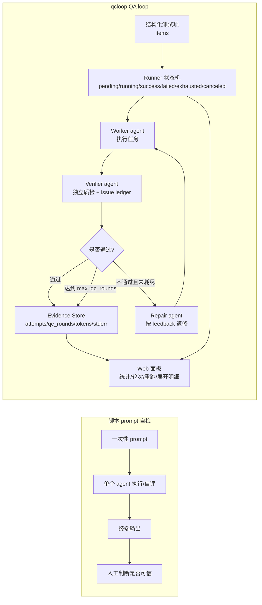
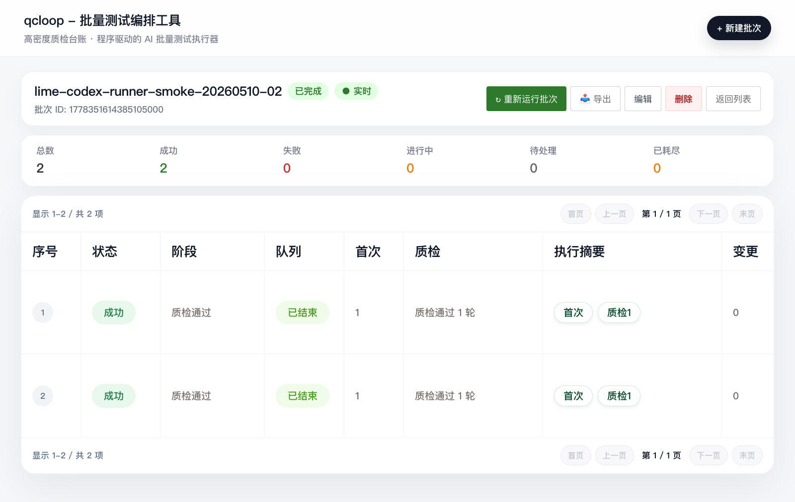

# qcloop

<div align="center">

**程序驱动的 AI 批量测试编排工具**

[](https://go.dev/)
[](https://reactjs.org/)
[](LICENSE)

[功能特性](#功能特性) • [快速开始](#快速开始) • [使用指南](#使用指南) • [架构设计](#架构设计) • [文档](#文档)

> **AI agent 使用者请读 [llms-full.txt](./llms-full.txt)**(导航索引见 [llms.txt](./llms.txt))。
> qcloop 的设计意图之一就是让 AI agent 自动提单、自动轮询、自动重试;人类只下发意图、授权和必要确认,不要手动在 UI 里逐项操作。
> AI 使用 qcloop 有两条主路径:支持 Skill 的 agent 走 [`skills/qcloop`](skills/qcloop/SKILL.md) + `qcloop-skill`;其他 agent 读取 `http://localhost:3000/llm-full.txt` 后直接调用 HTTP API。

**最快用法**:先打开 qcloop,再把这句话发给 Codex / Claude Code / Gemini CLI / Kiro CLI:

```text
请读取 http://localhost:3000/llm-full.txt，然后使用 qcloop 帮我测试当前任务。
```

`llm-full.txt` 会指导 AI 自动理解上下文、拆分自动化测试任务、创建批次并启动运行。完整说明见 [AI Agent 一句话使用指南](docs/AI_AGENT_USAGE.md)。如果你已经在 qcloop 启动环境中设置了 `QCLOOP_EXECUTOR_PROVIDER=claude_code|gemini_cli|kiro_cli`，AI 创建批次时会默认使用对应执行器；也可以在批次里显式传 `executor_provider`。

如果你的 Agent 支持技能，也可以直接启用仓库内置的 [`qcloop` 技能](skills/qcloop/SKILL.md)。该技能内置参考 Lime CLI 风格的 `qcloop-skill` 命令，供 AI 稳定执行 `doctor -> job create/run -> job wait/status/report -> item answer/retry/cancel -> queue metrics -> template CRUD` 流程，避免手写 curl；同一 CLI 已整理为 npm 包 [`@limecloud/qcloop-skill-cli`](packages/qcloop-skill-cli-npm/README.md)，方便全局安装或 `npx` 使用。

</div>

---

## 📖 项目简介

qcloop 是一个**批量测试编排工具**，专为 AI 驱动的测试场景设计。它通过程序化的方式遍历执行测试项，支持多轮质检和自动返修，确保测试不漏项、可追踪、高质量。

更准确地说，qcloop 是一个 **AI 批处理托管系统**：

- 人类只给意图，例如“ review 这 146 个文档并修复问题”。
- 外层 AI 通过 Skill 或 `llm.txt` 自动理解上下文、拆分 items、创建批次、启动、轮询和总结。
- qcloop 用数据库状态机确保真的逐项执行，并用 verifier/repair 多轮闭环、issue ledger 和执行器失败重试防止 AI 一次性糊弄或被本机 CLI 临时错误打断。
- 如果 AI 遇到歧义或高风险动作，会把 item 标为 `awaiting_confirmation`；外层 AI 向人提问后调用 API 写回答案继续跑，其他 item 不被阻塞。

### 为什么需要 qcloop？

**问题**：手动让 AI 执行批量测试时，容易出现：
- ❌ 遗漏测试项
- ❌ 重复执行
- ❌ 中断后难以恢复
- ❌ 缺少质检机制
- ❌ AI 遇到判断不了的问题时要么乱做、要么停在终端里
- ❌ 结果难以追踪

**解决方案**：qcloop 提供：
- ✅ 数据库驱动，确保不漏项
- ✅ 自动遍历，无需人工干预
- ✅ 多轮质检，自动返修
- ✅ 完整记录，可追溯
- ✅ Web 界面，实时监控
- ✅ 待确认闭环，AI 提问、人类确认、AI 写回并继续
- ✅ 目录 / glob / git diff 导入，适合大量文件逐个处理
- ✅ 睡前托管报告、批次取消、单 item 重试/取消
- ✅ 队列指标与批次模板，方便 AI 判断是否卡住并复用常见任务配置

### 不只是“agent 检查”

qcloop 底层确实可以驱动 Codex、Claude、Gemini 等 agent 完成检查；价值不在“让某个 agent 检查一次”，而在把 agent 检查工程化成可复用的 QA loop。

普通脚本 prompt 适合一次性自检，qcloop 解决的是批量、可观察、可复现、可审计的质检编排：

- **批量化**：把一组同质任务拆成结构化 item，逐项执行、逐项质检，不靠人工记忆维护进度。
- **可靠队列**：全局 worker pool 默认并发 2 个 item，使用 SQLite 租约 claim，支持断点继续和卡住 running 自动回收。
- **状态机**：每个 item 有 pending/running/success/failed/exhausted/awaiting_confirmation/canceled 等明确状态，重跑时会重置本轮可见状态并保留历史。
- **证据留痕**：完整保存参数、worker 输出、stderr、verifier verdict、feedback、tokens 和轮次记录。
- **失败返修**：verifier 不通过时自动进入 repair，repair 会带上上一轮 stdout/stderr/exit_code 与反馈；后续 verifier 会看到前序 `qc_rounds` issue ledger，直到通过或达到 `max_qc_rounds`。
- **执行器重试**：`max_executor_retries` 独立处理本机 AI CLI 启动/进程类错误，不消耗质检轮次。
- **确认闭环**：遇到高风险或歧义时 item 进入 `awaiting_confirmation`，外层 AI 读取问题、向人确认、写回答案并恢复。
- **托管收口**：Skill CLI 支持 `job report` 汇总长跑证据，支持 `job cancel` / `item retry` / `item cancel` 明确处理局部失败和终止。
- **队列可观测**：`queue metrics` 暴露 worker、active job/item、pending/running/awaiting/stale/canceled 等指标，AI 能判断是否真的在跑。
- **模板复用**：批次模板 API/CLI 支持保存常见 review / smoke / docs repair 配置，Web 可保存、套用、删除模板。
- **可视化观察**：Web 面板展示队列指标、模板、质检轮次、执行摘要、统计数字和展开明细，主操作仍由 AI 通过 Skill/API 完成。
- **模型可插拔**：qcloop 是编排层，不绑定某个模型；Codex/Claude 只是 worker/verifier 的实现选择。

类比来说，`agent 检查` 就像“能跑测试”；qcloop 更像给 AI agent 任务加上 CI、测试报告、失败重跑和质量台账。任务粒度小不是缺点，而是为了方便并行、定位失败和统计质量。

#### 架构对比



图里的关键差异是：脚本 prompt 把“检查”留在一次终端输出里；qcloop 把检查拆成可编排的状态机、独立 verifier、失败返修、确认写回、执行器失败重试、证据存储和可视化观察。

#### 一句话异步使用架构

下面这张图对应推荐用法：人只发一句 `请读取 http://localhost:3000/llm-full.txt，然后使用 qcloop 帮我测试当前任务。`，或让支持 Skill 的 agent 直接使用 `qcloop-skill`。外层 AI 自动理解上下文并提单；`/api/jobs/run` 只负责把批次放入全局队列并立即返回，真正的 worker / verifier / repair / confirmation 循环由后台 worker pool 与外层 AI 异步推进，Web 面板只做观察。


#### 产品界面预览

下面是 Playwright 从本地 qcloop 面板截取的真实详情页：可以直接看到批次状态、统计数字、分页、每个 item 的状态机、质检轮次标签和参数入口。



### 与 Codex `/goal` 的区别

Codex CLI 0.128.0 新增的 `/goal` 是官方版 Ralph loop,和 qcloop 解决的是类似问题,但设计哲学不同:

| | Codex `/goal` | qcloop |
|---|---|---|
| 停止条件 | AI 自评 + token budget(软) | `max_qc_rounds`(硬) |
| 判定主体 | 同一 thread 内 AI 自审 | 独立 verifier(外部判断) |
| 收敛保证 | 概率性 | 确定性 |
| 轮次可审计 | 黑盒 | 每轮落库 |
| API 稳定性 | experimental(文档未收录) | 稳定可用 |
| 最适场景 | 单目标探索 | 批量同质任务 |

**一句话**:单目标探索用 Goal,批量任务用 qcloop。qcloop 也支持 `--execution-mode goal_assisted` 把每条 prompt 包装成 Goal 风格,兼得两者优势。详见 [PRD 1.4 节](docs/PRD.md#14-设计哲学为什么选择-程序兜底-而不是-ai-自主)。

## 🎯 功能特性

### 核心功能

- **批量执行** - 一次创建，自动遍历所有测试项
- **全局队列** - 默认 2 个 worker 并发执行，lease 过期自动回收卡住 item
- **批量导入** - Skill CLI 可从目录、glob 或 git diff 自动生成结构化 items
- **多轮质检** - worker → verifier → repair 自动闭环
- **不漏项** - 数据库 claim 机制，确保每个测试项都被执行
- **可追踪** - 完整记录执行历史、质检结果、返修过程
- **AI 确认闭环** - item 级 `awaiting_confirmation`，由外层 AI 获取人类确认后写回继续
- **托管报告/取消** - `job report` 生成睡前托管报告，`job cancel` 进入不可恢复终态
- **实时监控** - Web 界面实时展示批次状态和执行进度
- **双界面** - CLI 命令 + Web 界面，灵活选择

### 工作流程

```
1. 创建批次
   ├─ 定义 Worker Prompt 模板
   ├─ 定义 Verifier Prompt 模板（可选）
   ├─ 提供测试项列表
   └─ 设置最大质检轮次

2. 执行批次
   ├─ Worker: 执行测试任务
   ├─ Verifier: 审查结果（输出 JSON verdict）
   ├─ Repair: 根据 feedback 自动返修
   └─ 循环直到通过或达到最大轮次

3. 查看结果
   ├─ 批次列表：所有批次概览
   ├─ 批次详情：统计卡片 + 测试项表格
   └─ 执行历史：每一轮的详细记录
```

## 🚀 快速开始

### 前置要求

- Go 1.21+
- Node.js 18+（仅前端需要）
- 至少一个本机 AI CLI 执行器：Codex CLI / Claude Code / Gemini CLI / Kiro CLI（默认 Codex）

### 安装

#### 方式 1：从源码构建

```bash
# 克隆仓库
git clone https://github.com/limecloud/qcloop.git
cd qcloop

# 构建后端
go build -o qcloop ./cmd/qcloop

# 安装到系统路径（可选）
sudo mv qcloop /usr/local/bin/
```

#### 方式 2：使用 Go Install

```bash
go install github.com/limecloud/qcloop/cmd/qcloop@latest
```

### 验证安装

```bash
qcloop --help
```

## 📚 使用指南

### 推荐：AI Agent 一句话使用

日常使用推荐先打开 qcloop 面板，然后把下面这句话发给 Codex / Claude Code / Gemini CLI / Kiro CLI。详细的上下文理解、任务拆分、提单、执行器选择和运行规则都内置在 `llm-full.txt` 中。

```text
请读取 http://localhost:3000/llm-full.txt，然后使用 qcloop 帮我测试当前任务。
```

完整说明见 [AI Agent 一句话使用指南](docs/AI_AGENT_USAGE.md)。

### 技能使用

仓库内置 [`skills/qcloop`](skills/qcloop/SKILL.md)，用于让支持技能的 AI agent 直接掌握 qcloop 工作流。技能内的 CLI 默认输出结构化 JSON，命令形态参考 Lime CLI；也可以通过 npm 包安装：

```bash
npm install -g @limecloud/qcloop-skill-cli
qcloop-skill doctor

# 或直接使用仓库内置 CLI
skills/qcloop/bin/qcloop-skill doctor
skills/qcloop/bin/qcloop-skill guide --full --raw
skills/qcloop/bin/qcloop-skill job create --file /tmp/qcloop-job.json --run
skills/qcloop/bin/qcloop-skill job create --file /tmp/qcloop-job.json --cwd "$PWD" --glob "docs/**/*.md" --run
skills/qcloop/bin/qcloop-skill job wait <job_id> --timeout 1800
skills/qcloop/bin/qcloop-skill job status <job_id> --include-items
skills/qcloop/bin/qcloop-skill job report <job_id> --format markdown
skills/qcloop/bin/qcloop-skill item answer <item_id> --answer "确认允许继续" --resume
skills/qcloop/bin/qcloop-skill item retry <item_id>
skills/qcloop/bin/qcloop-skill item cancel <item_id> --reason "该项暂不处理"
skills/qcloop/bin/qcloop-skill queue metrics
skills/qcloop/bin/qcloop-skill template list
```

完整索引见 [`skills/README.md`](skills/README.md)。日常仍推荐人只发一句话，技能 CLI 主要服务外层 AI 自动提单和轮询。

### CLI 使用（开发者 / 手动模式）

CLI 适合开发、调试或脚本集成；普通 AI agent 使用场景不推荐让人手动创建批次。

#### 1. 创建批次

```bash
qcloop create \
  --name "test-lime-workspace" \
  --prompt "测试 Lime workspace 功能: {{item}}" \
  --verifier-prompt "检查结果，输出 JSON: {\"pass\": bool, \"feedback\": \"OK\"}" \
  --items "create,read,update,delete" \
  --max-qc-rounds 3 \
  --executor-provider codex
```

**参数说明**：
- `--name`: 批次名称
- `--prompt`: Worker Prompt 模板（`{{item}}` 会被替换为实际测试项）
- `--verifier-prompt`: Verifier Prompt 模板（可选，用于质检）
- `--items`: 测试项列表（逗号分隔）
- `--max-qc-rounds`: 最大质检轮次（默认 3）
  - `1` 表示只做 worker + verifier，不会进入 repair；需要自动返修时建议使用 `3-5`

**输出示例**：
```
✅ 批次创建成功
━━━━━━━━━━━━━━━━━━━━━━━━━━━━━━━━━━━━━━━━
批次 ID: abc-123-def
批次名称: test-lime-workspace
测试项数: 4
最大质检轮次: 3
━━━━━━━━━━━━━━━━━━━━━━━━━━━━━━━━━━━━━━━━
```

#### 2. 运行批次

```bash
qcloop run --job-id abc-123-def
```

**输出示例**：
```
🚀 开始执行批次: test-lime-workspace
━━━━━━━━━━━━━━━━━━━━━━━━━━━━━━━━━━━━━━━━

[1/4] 执行测试项: create
  ✅ Worker 执行成功
  ✅ Verifier 通过

[2/4] 执行测试项: read
  ✅ Worker 执行成功
  ❌ Verifier 失败: 输出格式不正确
  🔧 Repair 执行中...
  ✅ Verifier 通过

...

━━━━━━━━━━━━━━━━━━━━━━━━━━━━━━━━━━━━━━━━
✅ 批次执行完成
```

#### 3. 查询状态

```bash
qcloop status --job-id abc-123-def
```

**输出示例**：
```
批次状态: test-lime-workspace
━━━━━━━━━━━━━━━━━━━━━━━━━━━━━━━━━━━━━━━━
批次 ID: abc-123-def
状态: completed
创建时间: 2026-05-09 23:00:00
完成时间: 2026-05-09 23:05:30
总耗时: 5m30s

测试项统计:
  总数: 4
  ✅ 成功: 3 (75.0%)
  ❌ 失败: 1 (25.0%)
  ⏳ 待处理: 0 (0.0%)
━━━━━━━━━━━━━━━━━━━━━━━━━━━━━━━━━━━━━━━━
```

### Web 界面使用（观察 / 开发模式）

Web 面板的核心用途是观察进度和查看证据。创建表单保留给调试；推荐让 Codex / Claude Code / Gemini CLI / Kiro CLI 通过 Skill 或 `llm-full.txt` 自动提单。

#### 1. 打开服务

日常使用直接用你的应用入口或团队封装方式打开 qcloop。下面命令只用于源码开发或排障：

```bash
qcloop serve --addr :8080 --workers 2
cd web
npm install
npm run dev
```

#### 2. 访问界面

打开浏览器访问：http://localhost:3000

#### 3. 界面功能

**批次列表页面**：
- 查看所有批次
- 显示批次名称、状态、测试项数、创建时间等
- 点击"查看详情"进入批次详情页

**批次详情页面**：
- 统计卡片：总数、成功、失败、进行中、待处理、已耗尽、待确认、已取消、可重试
- 测试项表格：10 列详细信息，含单 item 重试 / 取消
- 实时状态更新（WebSocket 优先，轮询兜底）
- 运行、暂停、恢复、取消批次和保存模板按钮

**创建批次表单**：
- 填写批次名称
- 输入 Worker Prompt 模板
- 输入 Verifier Prompt 模板（可选）
- 输入测试项列表（逗号分隔）
- 设置最大质检轮次

## 🏗️ 架构设计

### AI Agent 异步使用架构

推荐主路径不是人手动创建批次，而是“人一句话 → AI 读取 `llm-full.txt` → 从上下文/目录/glob/git diff 自动拆分测试任务 → qcloop 异步运行”。`POST /api/jobs/run` 会立即返回 `{status: started}`，后端全局 worker pool 通过 SQLite 租约 claim item 并推进状态机；默认 2 个 worker 并发执行，15 分钟租约过期的 running item 会自动回到队列。AI 和 Web 面板都通过 API 轮询观察结果，长跑结束后 AI 可用 `job report` 生成托管报告。


### 系统架构

```
┌─────────────────────────────────────────────────────────┐
│                    用户交互层                            │
│  ┌──────────────┐              ┌──────────────┐        │
│  │  CLI 命令    │              │  Web 界面    │        │
│  └──────────────┘              └──────────────┘        │
└─────────────────────────────────────────────────────────┘
                         │
                         ▼
┌─────────────────────────────────────────────────────────┐
│                    API 层                                │
│              HTTP API Server (RESTful + CORS)           │
└─────────────────────────────────────────────────────────┘
                         │
                         ▼
┌─────────────────────────────────────────────────────────┐
│                    编排层                                │
│     全局 QueueManager + Runner（并发 claim / 断点恢复）  │
└─────────────────────────────────────────────────────────┘
                         │
                         ▼
┌─────────────────────────────────────────────────────────┐
│                    执行层                                │
│ Provider Adapter → Codex / Claude Code / Gemini / Kiro  │
└─────────────────────────────────────────────────────────┘
                         │
                         ▼
┌─────────────────────────────────────────────────────────┐
│                    存储层                                │
│              SQLite（5 张表）                           │
└─────────────────────────────────────────────────────────┘
```

### 数据模型

```
batch_jobs (批次)
  ├─ id, name, prompt_template
  ├─ verifier_prompt_template
  ├─ max_qc_rounds, max_executor_retries, run_no
  ├─ status(completed=全成功, failed=存在失败/耗尽, canceled=已终止)
  └─ created_at, finished_at

batch_items (测试项)
  ├─ id, batch_job_id, item_value
  ├─ status, current_attempt_no, current_qc_no
  ├─ last_error, confirmation_question, confirmation_answer
  ├─ lock_owner, lock_expires_at, queued_at
  └─ created_at, finished_at

attempts (执行尝试)
  ├─ id, batch_item_id, attempt_no, run_no
  ├─ attempt_type (worker/repair)
  ├─ status, stdout, stderr, exit_code
  └─ started_at, finished_at

qc_rounds (质检轮次)
  ├─ id, batch_item_id, qc_no, run_no
  ├─ status, verdict, feedback
  └─ started_at, finished_at

batch_templates (批次模板)
  ├─ prompt_template, verifier_prompt_template, items_text
  └─ max_qc_rounds, max_executor_retries, execution_mode, executor_provider
```

### 多轮质检流程

```
开始
  │
  ▼
Worker 执行
  │
  ▼
保存 attempt(stdout/stderr/exit_code)
  │
  ▼
是否配置 verifier? ──否──▶ 标记为 success ──▶ 完成
  │
  是
  ▼
运行 Verifier(可读取 stdout/stderr/exit_code)
  │
  ▼
解析 verdict JSON
  │
  ▼
verdict.pass? ──是──▶ 标记为 success ──▶ 完成
  │
  否
  ▼
是否达到 max_qc_rounds? ──是──▶ 标记为 exhausted ──▶ 完成
  │
  否
  ▼
Repair(携带上一轮证据 + feedback,修复并复测)
  │
  ▼
保存 repair attempt(stdout/stderr/exit_code)
  │
  ▼
进入下一轮 Verifier
```

## 📂 项目结构

```
qcloop/
├── cmd/qcloop/              # CLI 入口
│   └── main.go
├── internal/
│   ├── db/                  # 数据库层
│   │   ├── db.go            # 数据库连接
│   │   ├── models.go        # 数据模型
│   │   ├── schema.go        # 表结构
│   │   └── dao.go           # CRUD 操作
│   ├── core/                # 编排引擎
│   │   └── runner.go        # 多轮质检逻辑
│   ├── executor/            # 执行器
│   │   ├── provider.go      # provider 选择与默认值
│   │   ├── agent_cli.go     # Claude/Gemini/Kiro 共享 CLI 执行器
│   │   ├── cli_process.go   # 进程探测与执行公共逻辑
│   │   ├── codex.go         # Codex Executor
│   │   └── fake.go          # Fake Executor（测试用）
│   └── api/                 # HTTP API
│       └── server.go        # RESTful 服务器
├── web/                     # React 前端
│   ├── src/
│   │   ├── components/      # UI 组件
│   │   │   ├── BatchTable.tsx
│   │   │   ├── CreateJobForm.tsx
│   │   │   └── StatusBadges.tsx
│   │   ├── hooks/           # React Hooks
│   │   │   └── usePollingItems.ts
│   │   ├── api/             # API 客户端
│   │   │   └── index.ts
│   │   ├── types/           # TypeScript 类型
│   │   │   └── index.ts
│   │   ├── App.tsx
│   │   ├── main.tsx
│   │   └── styles.css
│   ├── index.html
│   ├── package.json
│   ├── tsconfig.json
│   └── vite.config.ts
├── docs/                    # 文档
│   ├── AI_AGENT_USAGE.md     # 多 AI CLI 一句话使用指南
│   ├── PRD.md               # 产品需求文档（含设计哲学、用户故事）
│   ├── TEST_CASES.md        # 测试用例（32 个测试点）
│   ├── QUICK_TEST.md        # 快速测试指南
│   ├── GOAL_INTEGRATION.md  # Codex Goal 集成方案
│   ├── PROJECT_SUMMARY.md   # 项目完成总结
│   └── images/              # 文档图片（含异步使用架构图）
├── skills/                  # 给 AI agent 使用的 qcloop 技能与 JSON CLI
│   └── qcloop/
│       ├── SKILL.md
│       ├── bin/qcloop-skill
│       └── scripts/qcloop_cli.py
├── packages/                # 可发布包
│   └── qcloop-skill-cli-npm/ # @limecloud/qcloop-skill-cli npm 包
├── go.mod
├── go.sum
├── README.md
└── LICENSE
```

## 👥 用户故事

### 故事 1：批量执行测试用例

**角色**：测试工程师

**场景**：我有 100 个 Lime 功能需要测试，手动一个一个测试太慢了。

**解决方案**：
1. 创建一个批次，包含所有测试项
2. qcloop 自动遍历执行每个测试项
3. 实时查看执行进度
4. 执行完成后查看详细结果

### 故事 2：确保测试质量

**角色**：QA 负责人

**场景**：AI 执行的测试可能不准确，我需要质检机制来验证结果。

**解决方案**：
1. 配置 verifier prompt 来审查测试结果
2. 如果质检失败，系统把上一轮 stdout/stderr/exit_code 和反馈交给 repair 自动返修
3. 支持多轮质检，直到通过或达到上限
4. 查看每一轮的质检结果和反馈

### 故事 3：追踪批次执行情况

**角色**：项目经理

**场景**：我需要了解批次的整体进度和每个测试项的详细状态。

**解决方案**：
1. 查看所有批次的列表
2. 每个批次显示关键信息（名称、状态、测试项数、创建时间）
3. 点击批次查看详细信息
4. 详细页面显示每个测试项的执行情况

## 📖 文档

- [AI Agent 一句话使用指南](docs/AI_AGENT_USAGE.md) - 打开 qcloop 后,让 Codex / Claude Code / Gemini CLI / Kiro CLI 读取 `http://localhost:3000/llm-full.txt`,自动理解上下文、选择执行器、拆分测试任务并自动提单
- [qcloop 技能](skills/qcloop/SKILL.md) - 给支持技能的 AI agent 使用，内置 `qcloop-skill` JSON CLI，稳定执行 doctor / job create / run / wait / status / report / retry / cancel 流程
- [`@limecloud/qcloop-skill-cli` npm 包](packages/qcloop-skill-cli-npm/README.md) - 可全局安装或 npx 调用的 qcloop 技能 CLI
- [AI Agent 异步使用架构图](docs/images/qcloop-async-agent-flow.svg) - 展示 Skill/llm 双入口、一句话驱动、自动提单、异步启动和 Web 观察
- [产品需求文档 (PRD)](docs/PRD.md) - 含设计哲学、用户故事、界面设计
- [测试用例文档](docs/TEST_CASES.md) - 32 个详细测试用例
- [快速测试指南](docs/QUICK_TEST.md) - 5 分钟快速测试
- [Codex Goal 集成方案](docs/GOAL_INTEGRATION.md) - 未来功能规划
- [项目完成总结](docs/PROJECT_SUMMARY.md) - 项目成果总结

## 🛠️ 技术栈

**后端**：
- Go 1.21+
- SQLite 3
- cobra（CLI 框架）
- net/http（HTTP 服务器）

**前端**：
- React 18
- TypeScript
- Vite
- 自定义 Hooks

**执行器**：
- 默认 `codex exec`，也支持 `claude -p`、`gemini -p`、`kiro-cli chat --no-interactive`。
- 批次字段 `executor_provider` 可选 `codex` / `claude_code` / `gemini_cli` / `kiro_cli`；全局默认可用 `QCLOOP_EXECUTOR_PROVIDER` 设置。
- 权限与账号仍由各 CLI 自己管理；qcloop 不保存 Claude / Gemini / Kiro 凭证。Claude Code team 展示模式可用 `QCLOOP_CLAUDE_TEAMMATE_MODE=auto|in-process|tmux`。详见 [AI Agent 一句话使用指南](docs/AI_AGENT_USAGE.md)。

## 🔧 开发

### 运行测试

```bash
go test ./...
```

### 本地开发

```bash
# 后端
go run ./cmd/qcloop serve --addr :8080 --workers 2

# 前端
cd web
npm run dev
```

### 构建生产版本

```bash
# 后端
go build -o qcloop ./cmd/qcloop

# 前端
cd web
npm run build
```

## 🤝 贡献

欢迎贡献代码、报告问题或提出建议！

1. Fork 本仓库
2. 创建特性分支 (`git checkout -b feature/AmazingFeature`)
3. 提交更改 (`git commit -m 'Add some AmazingFeature'`)
4. 推送到分支 (`git push origin feature/AmazingFeature`)
5. 开启 Pull Request

## 📝 License

本项目采用 MIT 许可证 - 详见 [LICENSE](LICENSE) 文件

## 🙏 致谢

- [Codex CLI](https://github.com/openai/codex)、[Claude Code](https://code.claude.com/docs/)、[Gemini CLI](https://google-gemini.github.io/gemini-cli/)、[Kiro CLI](https://kiro.dev/docs/cli/) - 可插拔 AI 执行器
- [Cobra](https://github.com/spf13/cobra) - CLI 框架
- [React](https://reactjs.org/) - 前端框架
- [Vite](https://vitejs.dev/) - 前端构建工具

---

<div align="center">

**[⬆ 回到顶部](#qcloop)**

Made with ❤️ by the qcloop team

</div>
