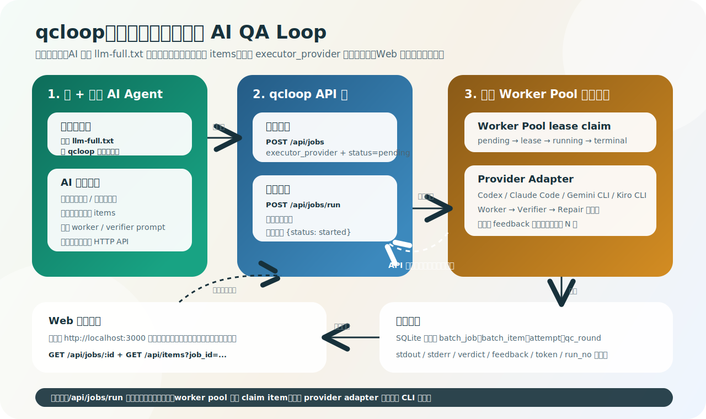

# AI Agent 一句话使用指南

这篇文档面向 qcloop 的真实使用方式：**人先打开 qcloop 应用，然后让 Codex / Claude Code / Gemini CLI / Kiro CLI 等 AI agent 读取本地说明并自动创建、运行、观察批量测试任务**。

推荐路径不是让人手动敲命令、手动填 UI 或手动拼 API JSON。人只负责打开应用、授权 agent、打开面板监管；提单、启动、轮询和总结由 AI agent 完成。

---

## 1. 推荐路径：先打开 qcloop 应用

先用你平时的方式打开 qcloop。它可以是应用入口、开发环境、部署服务或团队封装好的启动脚本；这篇使用文档不把命令行作为日常推荐入口。

确认下面地址可访问：

- Web 面板：`http://localhost:3000`
- Agent 完整说明：`http://localhost:3000/llm-full.txt`
- Agent 简短索引：`http://localhost:3000/llm.txt`

兼容别名也可用：

- `http://localhost:3000/llms-full.txt`
- `http://localhost:3000/llms.txt`

如果这些地址打不开，先回到 qcloop 应用启动流程处理，不要把“手动执行一串命令”当成普通用户主路径。源码开发或排障场景见文末附录。

---

## 2. 复制这句话给 Codex / Claude Code / Gemini CLI / Kiro CLI

### 最小提示词

把下面这句话发给 Codex、Claude Code、Gemini CLI、Kiro CLI 或其他能访问本机 HTTP 的 agent：

```text
请读取 http://localhost:3000/llm-full.txt，然后使用 qcloop 帮我测试当前任务。
```

这句话故意保持很短。`llm-full.txt` 会告诉 AI：自动理解“当前任务”的上下文，自动拆分适合 qcloop 的测试 items，自动创建批次并启动运行，不要让你手动填 UI。

### 指定项目路径版

如果目标项目不是当前目录，把路径说清楚：

```text
请读取 http://localhost:3000/llm-full.txt，然后使用 qcloop 帮我测试 /path/to/project。
```

### 稍微补充目标

如果你已经知道要测什么，可以在最小提示词后补一句：

```text
请读取 http://localhost:3000/llm-full.txt，然后使用 qcloop 帮我测试当前任务。重点验证：package scripts 是否存在并可执行、关键 smoke test 是否能跑通；只读检查，不要修改文件。
```

---

## 3. Codex 的 permissions 怎么处理

Codex 有自己的 permissions / sandbox 机制。qcloop 的推荐用法不是靠 prompt 绕过权限，而是让用户在 Codex 里明确选择允许范围。

如果你平时像截图里那样使用 Codex TUI，可以走这条最短路径：

```text
/permissions
```

然后选择：

```text
Full Access
```

这个模式下，外层 Codex 可以读取 `http://localhost:3000/llm-full.txt`、访问 qcloop 本地 API、分析目标仓库并提交批次，不会因为普通本机操作频繁打断确认。

如果你不想开 Full Access，也可以只允许外层 agent：

- 读取 `http://localhost:3000/llm-full.txt`
- 访问 qcloop 本地 API：`http://localhost:8080/api/...`
- 读取目标仓库，用于设计测试项
- 必要时发起本机 HTTP 请求

sandbox 是否开启取决于你的本地习惯和风险边界：

- **本机信任模式**：你平时不用 sandbox，可以在 Codex TUI 的 `/permissions` 里选择 `Full Access`。
- **保守模式**：保留 sandbox，只允许 workspace 写入，适合不想让 agent 碰工作区外文件的人。
- **隔离环境模式**：在容器、临时 VM、CI runner 中，可以使用更宽的权限，因为外部环境已经隔离。

qcloop 不强制你必须使用 sandbox。它只要求外层 agent 能读取说明并提单，内层 worker 能按批次要求执行任务。

---

## 4. qcloop 内部 worker 执行器与权限

qcloop 后端会为每个 item 启动内层 worker/verifier/repair。内层执行器现在可选：

| `executor_provider` | 默认命令形态 | 适合场景 |
|---|---|---|
| `codex` | `codex exec <prompt>` | 默认路径，沿用 Codex permissions / sandbox 配置 |
| `claude_code` | `claude -p <prompt>` | 想用 Claude Code 跑 headless 任务，或使用 Claude Code team/teammate 展示模式 |
| `gemini_cli` | `gemini -p <prompt>` | 想用 Gemini CLI 的 headless、JSON/stream-json 或 sandbox 能力 |
| `kiro_cli` | `kiro-cli chat --no-interactive <prompt>` | 想用 Kiro CLI headless agent 跑任务 |

也就是说，实际使用时可能有两层权限：

1. **外层 agent 权限**：你正在交互的 Codex / Claude Code / Gemini CLI / Kiro CLI，负责读取 `llm-full.txt` 并让 qcloop 创建、运行批次。
2. **内层 worker 权限**：qcloop 后端按 `executor_provider` 启动本机 CLI，负责实际执行每个 item。

外层权限通常在你当前 agent 里授权。内层权限由 qcloop 的启动环境或部署配置提前设置，普通使用者不需要手动处理。qcloop 不保存 Claude / Gemini / Kiro 凭证，也不管理 team / organization 账号；它只调用本机已经登录或已配置 API key 的 CLI。

### 4.1 通用选择

| 环境变量 | 说明 |
|---|---|
| `QCLOOP_EXECUTOR_PROVIDER` | 创建批次未显式传 `executor_provider` 时的默认值：`codex` / `claude_code` / `gemini_cli` / `kiro_cli` |

Web 创建/编辑批次表单也可以直接选择执行器。AI 通过 API 创建批次时可显式传：

```json
{
  "executor_provider": "claude_code",
  "execution_mode": "standard"
}
```

### 4.2 Codex 内层配置

qcloop 默认不强制给内层 `codex exec` 加 sandbox 参数，优先尊重你本机 Codex 配置。

| 环境变量 | 说明 |
|---|---|
| `QCLOOP_CODEX_BIN` | 指定 codex 二进制路径，避免 PATH 里有坏的 `codex` |
| `QCLOOP_CODEX_CWD` / `QCLOOP_CODEX_WORKDIR` | 给 `codex exec` 指定 worker 工作目录 |
| `QCLOOP_CODEX_APPROVAL_POLICY` | 覆盖内层 Codex approval policy，常用值是 `never` |
| `QCLOOP_CODEX_SANDBOX` | 可选：`read-only` / `workspace-write` / `danger-full-access`；`off`、`none`、`full` 会映射为 `danger-full-access` |
| `QCLOOP_CODEX_EXTRA_ARGS` | 追加其他 Codex 参数，例如模型或输出格式参数 |
| `QCLOOP_CODEX_BYPASS_SANDBOX` | 追加 Codex bypass 参数；只建议在容器、临时 VM 或 CI runner 中使用 |

### 4.3 Claude Code 内层配置

Claude Code 默认命令是 `claude -p <prompt>`。team 模式不由 qcloop 登录或分配账号，而是复用你本机 Claude Code 的 team / organization / SSO / managed settings。qcloop 只透传官方 CLI 参数。

| 环境变量 | 说明 |
|---|---|
| `QCLOOP_CLAUDE_BIN` | 指定 `claude` 路径 |
| `QCLOOP_CLAUDE_CWD` / `QCLOOP_CLAUDE_WORKDIR` | 指定执行工作目录 |
| `QCLOOP_CLAUDE_PERMISSION_MODE` | 透传 `--permission-mode` |
| `QCLOOP_CLAUDE_DANGEROUSLY_SKIP_PERMISSIONS` | 透传 `--dangerously-skip-permissions`；仅在隔离环境或你明确信任时使用 |
| `QCLOOP_CLAUDE_TEAMMATE_MODE` | 透传 `--teammate-mode`，可选 `auto` / `in-process` / `tmux` |
| `QCLOOP_CLAUDE_MODEL` / `QCLOOP_CLAUDE_MAX_TURNS` / `QCLOOP_CLAUDE_SETTINGS` | 透传模型、最大轮数和 settings 文件 |
| `QCLOOP_CLAUDE_EXTRA_ARGS` | 追加其他 Claude Code 参数 |

### 4.4 Gemini CLI / Kiro CLI 内层配置

| 环境变量 | 说明 |
|---|---|
| `QCLOOP_GEMINI_BIN` | 指定 `gemini` 路径 |
| `QCLOOP_GEMINI_CWD` / `QCLOOP_GEMINI_WORKDIR` | 指定执行工作目录 |
| `QCLOOP_GEMINI_APPROVAL_MODE` / `QCLOOP_GEMINI_YOLO` / `QCLOOP_GEMINI_SANDBOX` | 透传 approval、YOLO 和 sandbox 相关能力 |
| `QCLOOP_GEMINI_MODEL` / `QCLOOP_GEMINI_EXTRA_ARGS` | 透传模型和其他参数 |
| `QCLOOP_KIRO_BIN` | 指定 `kiro-cli` 路径 |
| `QCLOOP_KIRO_CWD` / `QCLOOP_KIRO_WORKDIR` | 指定执行工作目录 |
| `QCLOOP_KIRO_TRUST_ALL_TOOLS` / `QCLOOP_KIRO_TRUST_TOOLS` | 透传 Kiro headless trust 选项 |
| `QCLOOP_KIRO_REQUIRE_MCP_STARTUP` / `QCLOOP_KIRO_AGENT` / `QCLOOP_KIRO_EXTRA_ARGS` | 透传 MCP 启动、agent 和其他参数 |

如果 worker 无法自动执行，优先检查：

- 对应 CLI 是否能在同一机器上正常 headless 运行
- qcloop 启动环境是否能找到对应二进制
- worker 是否有目标仓库的读写权限
- 内层 CLI 是否被 approval / sandbox / trust tools / API key 卡住

---

## 5. 人应该看哪里

agent 提单后，人只需要打开：

```text
http://localhost:3000
```

重点看：

- 批次是否进入 `running` / `completed` / `failed`；`completed` 表示全部 item 成功，`failed` 表示批次已结束但存在失败或耗尽项
- 统计数字是否合理：成功、失败、进行中、待处理、已耗尽
- 每个 item 的 `首次`、`质检1..N` 标签是否符合预期
- 展开行后查看参数、stdout、stderr、verifier verdict、feedback
- 如果批次已经完成，可以点击重新运行；qcloop 会保留历史，同时按本轮重新显示状态和标签
- 如果需要自动返修，`max_qc_rounds` 不要设为 `1`；`1` 轮只会 worker + verifier，未通过会直接 `exhausted`

---

## 6. AI 实际会做什么

你的一句话不是让 AI “给你一串命令”。正确分工是：

```text
人：打开 qcloop + 授权 Codex / Claude Code / Gemini CLI / Kiro CLI + 发一句最小提示词 + 打开 Web 面板监管
AI agent：读取 llm-full.txt + 理解当前任务 + 设计 items + 创建/启动批次 + 轮询/总结结果
qcloop：负责全局队列、断点恢复、状态机、worker/verifier/repair、证据留存；repair 会拿到上一轮 stdout/stderr/exit_code 和质检反馈,用于修复后复测
```



关键异步点：AI 调 `POST /api/jobs/run` 后，qcloop API 会立即返回 `{status: started}`；后端全局 worker pool 默认并发 2 个 item，通过 SQLite lease claim 任务并继续执行 worker / verifier / repair。Web 面板和 AI 都通过 API 轮询观察状态；如果进程重启或 item 卡在 running，15 分钟租约过期后会自动回到队列。

一句话：**人只监管，agent 负责提单，qcloop 负责把 agent 检查变成可追踪的 QA loop。**

---

## 7. 开发 / 排障附录：源码启动方式

本节只给开发者或排障使用，不是推荐给普通使用者的主路径。如果你已经能通过应用入口打开 qcloop，可以跳过本节。

在 qcloop 仓库中启动后端：

```bash
./qcloop serve --addr :8080 --workers 2
```

另开一个终端启动前端：

```bash
cd web
npm run dev -- --host 127.0.0.1
```

如果需要临时覆盖内层 Codex worker 权限，或调整全局队列并发数，可以在启动 qcloop 的环境中设置变量。例如本机信任模式：

```bash
QCLOOP_CODEX_APPROVAL_POLICY=never \
QCLOOP_CODEX_SANDBOX=off \
QCLOOP_WORKER_COUNT=2 \
./qcloop serve --addr :8080 --workers 2
```

如果希望 worker 固定在某个目标仓库执行：

```bash
QCLOOP_CODEX_CWD=/path/to/project \
QCLOOP_CODEX_APPROVAL_POLICY=never \
QCLOOP_CODEX_SANDBOX=off \
QCLOOP_WORKER_COUNT=2 \
./qcloop serve --addr :8080 --workers 2
```

如果希望默认使用 Claude Code，并打开 teammate/team 展示模式：

```bash
QCLOOP_EXECUTOR_PROVIDER=claude_code \
QCLOOP_CLAUDE_TEAMMATE_MODE=tmux \
QCLOOP_CLAUDE_PERMISSION_MODE=bypassPermissions \
QCLOOP_WORKER_COUNT=2 \
./qcloop serve --addr :8080 --workers 2
```

如果希望默认使用 Gemini CLI 或 Kiro CLI，只需要替换 provider，并确保对应 CLI 在同一启动环境里已登录或已配置 API key：

```bash
QCLOOP_EXECUTOR_PROVIDER=gemini_cli ./qcloop serve --addr :8080 --workers 2
QCLOOP_EXECUTOR_PROVIDER=kiro_cli ./qcloop serve --addr :8080 --workers 2
```
