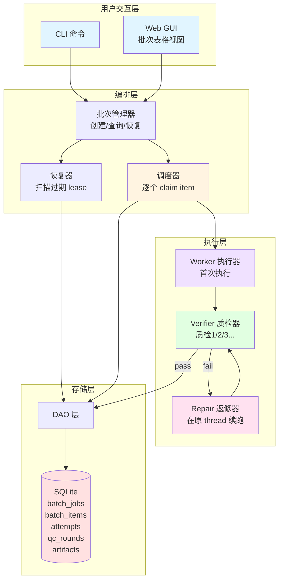
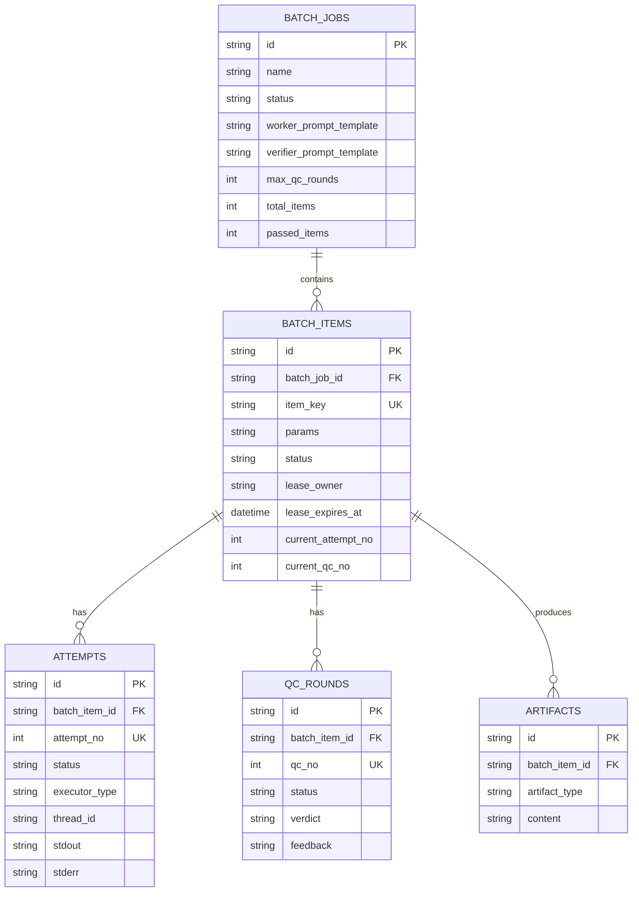
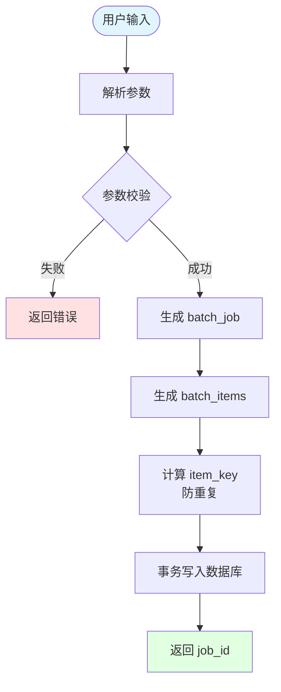
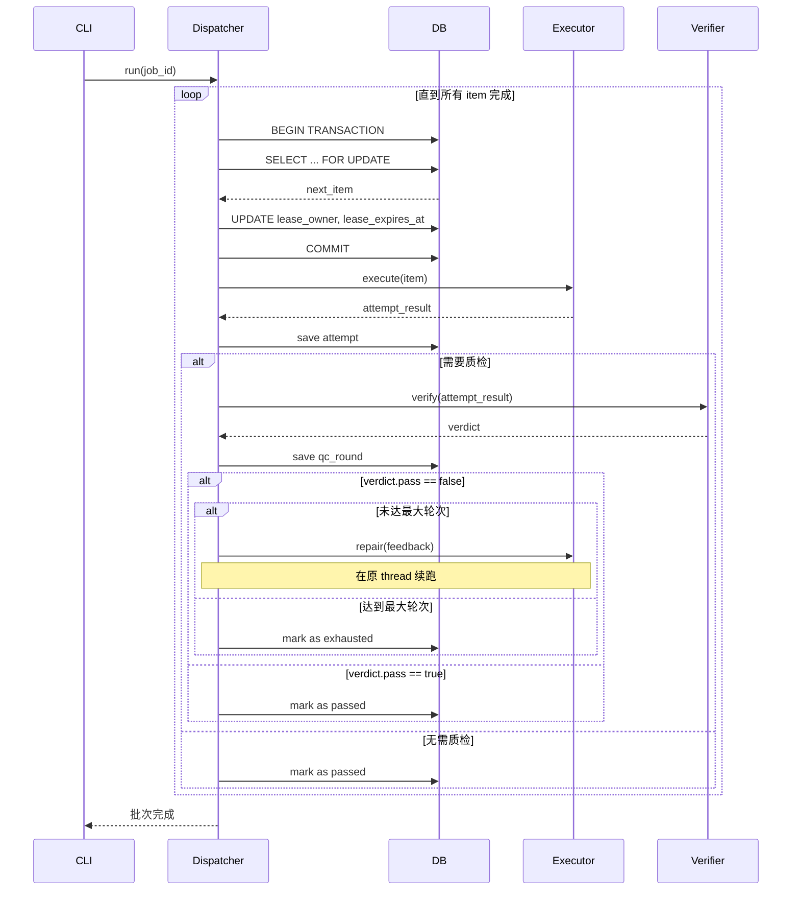
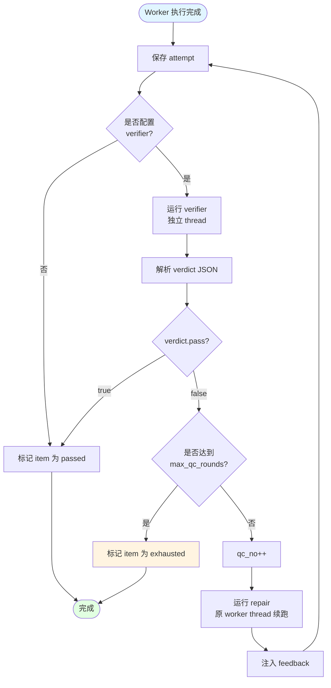

# qcloop 产品需求文档 (PRD)

## 1. 产品概述

### 1.1 产品定位
qcloop 是一个**程序驱动的 AI 批量测试编排工具**，专门用于 Lime 项目的系统化测试。它解决了"让 AI 自觉一个一个处理"的不可靠问题，通过数据库事务、串行调度、多轮质检确保批量任务不漏项、可恢复、可追踪。

### 1.2 核心价值
- **可靠性** - 程序驱动替代 AI 自觉，确保每个测试项都被执行
- **可恢复性** - 崩溃后自动恢复未完成项，支持断点续跑
- **可追踪性** - 完整的执行历史、轮次记录、产物存储
- **质量保证** - worker -> verifier -> repair 自动闭环，多轮质检

### 1.3 目标用户
- Lime 项目开发者
- QA 测试工程师
- 需要批量执行 AI 驱动测试的团队

## 2. 核心功能

### 2.1 批次管理

#### 2.1.1 创建批次
**功能描述**：用户提供 prompt 模板和测试项列表，创建一个批次任务。

**输入参数**：
- `name` - 批次名称（必填）
- `description` - 批次描述（可选）
- `worker_prompt_template` - worker 执行模板（必填）
  - 支持变量替换：`{{item}}`, `{{file_path}}`, `{{test_case}}` 等
- `verifier_prompt_template` - verifier 质检模板（可选）
  - 要求输出结构化 JSON：`{"pass": bool, "feedback": string}`
- `repair_prompt_template` - repair 返修模板（可选）
- `items` - 测试项列表（必填）
  - 支持逗号分隔：`item1,item2,item3`
  - 支持文件路径：`file1.md,file2.md`
- `max_qc_rounds` - 最大质检轮次（默认 3）
- `concurrency` - 并发度（MVP 固定为 1）

**输出**：
- 批次 ID
- 批次状态
- 总测试项数

**CLI 示例**：
```bash
qcloop create \
  --name "test-lime-workspace" \
  --description "批量测试 Lime workspace 功能" \
  --worker-prompt "测试 Lime workspace 功能: {{test_case}}" \
  --verifier-prompt "检查测试结果是否符合预期，输出 JSON: {\"pass\": bool, \"feedback\": string}" \
  --items "create_workspace,read_config,update_settings,delete_workspace" \
  --max-qc-rounds 3
```

#### 2.1.2 运行批次
**功能描述**：启动批次执行，逐个处理测试项。

**执行流程**：
1. dispatcher 从数据库 claim 下一条 `pending` 或 `retry_pending` 的 item
2. 在事务内写入 `lease_owner` 和 `lease_expires_at`
3. 事务提交成功后，启动 executor 执行
4. 执行完成后，更新 item 状态
5. 重复直到所有 item 完成

**CLI 示例**：
```bash
qcloop run --job-id <job-id>
```

#### 2.1.3 查询状态
**功能描述**：查询批次整体状态和进度。

**输出信息**：
- 批次 ID、名称、描述
- 状态：`pending/running/completed/failed/canceled/paused`
- 总测试项数
- 已通过项数
- 已耗尽项数（达到最大轮次仍未通过）
- 已取消项数
- 开始时间、结束时间

**CLI 示例**：
```bash
qcloop status --job-id <job-id>
```

#### 2.1.4 查询详情
**功能描述**：查询单个测试项的详细执行历史。

**输出信息**：
- item ID、参数、状态
- 执行尝试列表（attempt）
  - 尝试编号、状态、开始/结束时间、耗时
  - executor 类型、thread ID、session ID
  - stdout、stderr、exit code
- 质检轮次列表（qc_round）
  - 轮次编号、状态、开始/结束时间、耗时
  - verifier thread ID
  - verdict（结构化判定）、feedback（返修建议）
- 产物列表（artifact）
  - 产物类型、内容、创建时间

**CLI 示例**：
```bash
qcloop detail --job-id <job-id> --item-id <item-id>
```

#### 2.1.5 恢复中断批次
**功能描述**：崩溃后自动恢复未完成的批次。

**恢复逻辑**：
1. 扫描所有 `lease_expires_at` 已过期的 item
2. 检查对应的 attempt 和 qc_round 实际终态
3. 根据终态回滚 item 状态：
   - attempt 成功 + qc 未开始 -> `pending`（进入质检）
   - attempt 成功 + qc 失败 -> `retry_pending`（返修）
   - attempt 失败 -> `retry_pending`（重试）
4. 清空 `lease_owner` 和 `lease_expires_at`

**CLI 示例**：
```bash
qcloop recover --job-id <job-id>
```

### 2.2 执行器（Executor）

#### 2.2.1 Executor 接口
```go
type Executor interface {
    Execute(ctx context.Context, params ExecuteParams) (*ExecuteResult, error)
}

type ExecuteParams struct {
    Prompt      string
    ThreadID    *string  // 续跑时提供
    Timeout     time.Duration
}

type ExecuteResult struct {
    Status       AttemptStatus
    ThreadID     *string
    SessionID    *string
    ExitCode     *int
    Stdout       string
    Stderr       string
    ErrorMessage string
    DurationMs   int64
}
```

#### 2.2.2 Codex Executor
**功能描述**：通过子进程调用 `codex exec` 执行测试。

**实现要点**：
- 使用 `os/exec` 启动子进程
- 捕获 stdout 和 stderr
- 支持超时控制（context.WithTimeout）
- 提取 thread_id（从 stdout 解析）
- 支持续跑（传入 thread_id）

**调用示例**：
```bash
codex exec --prompt "测试 Lime workspace 功能: create_workspace"
```

#### 2.2.3 Fake Executor
**功能描述**：测试用 fake 实现，模拟成功/失败。

**用途**：
- 单元测试
- 集成测试
- 验证状态机转换

### 2.3 质检器（QC）

#### 2.3.1 Verifier
**功能描述**：独立审查 worker 执行结果，判断是否通过。

**输入**：
- verifier_prompt_template
- worker 执行产物（stdout、diff 等）

**输出**：
- verdict（结构化 JSON）
  ```json
  {
    "pass": true,
    "feedback": "测试通过，workspace 创建成功"
  }
  ```

**实现要点**：
- 使用独立的 verifier thread（不复用 worker thread）
- 解析 JSON verdict
- 如果 `pass: false`，提取 feedback 用于 repair

#### 2.3.2 Repair
**功能描述**：根据 verifier feedback 返修。

**输入**：
- repair_prompt_template
- verifier feedback

**输出**：
- 新的执行结果

**实现要点**：
- 在原 worker thread 上续跑（保留上下文）
- 注入 feedback 到 repair prompt
- 重复 verifier -> repair 直到通过或达到 `max_qc_rounds`

### 2.4 状态机

#### 2.4.1 BatchJob 状态
```
pending -> running -> completed
                   -> failed
                   -> canceled
                   -> paused
```

#### 2.4.2 BatchItem 状态
```
pending -> claimed -> running -> qc_running -> passed (终态)
                              -> qc_failed -> retry_pending -> running
                                           -> exhausted (终态)
                                           -> canceled (终态)
```

#### 2.4.3 Attempt 状态
```
running -> success
        -> error
        -> timeout
        -> canceled
```

#### 2.4.4 QCRound 状态
```
running -> pass
        -> fail
        -> error
```

## 3. 数据模型

### 3.1 数据库表

#### 3.1.1 batch_jobs
批次表，存储批次定义和汇总统计。

| 字段 | 类型 | 说明 |
|------|------|------|
| id | TEXT | 主键 |
| name | TEXT | 批次名称 |
| description | TEXT | 批次描述 |
| status | TEXT | 状态 |
| worker_prompt_template | TEXT | worker 模板 |
| verifier_prompt_template | TEXT | verifier 模板 |
| repair_prompt_template | TEXT | repair 模板 |
| max_qc_rounds | INTEGER | 最大质检轮次 |
| concurrency | INTEGER | 并发度 |
| created_at | TEXT | 创建时间 |
| started_at | TEXT | 开始时间 |
| finished_at | TEXT | 结束时间 |
| total_items | INTEGER | 总测试项数 |
| passed_items | INTEGER | 已通过项数 |
| exhausted_items | INTEGER | 已耗尽项数 |
| canceled_items | INTEGER | 已取消项数 |

#### 3.1.2 batch_items
批次项表，存储单个测试项的状态和 lease 信息。

| 字段 | 类型 | 说明 |
|------|------|------|
| id | TEXT | 主键 |
| batch_job_id | TEXT | 外键 -> batch_jobs.id |
| item_key | TEXT | 参数 hash（去重） |
| params | TEXT | JSON 格式参数 |
| status | TEXT | 状态 |
| lease_owner | TEXT | lease 持有者 |
| lease_expires_at | TEXT | lease 过期时间 |
| current_attempt_no | INTEGER | 当前尝试编号 |
| current_qc_no | INTEGER | 当前质检编号 |
| created_at | TEXT | 创建时间 |
| claimed_at | TEXT | claim 时间 |
| finished_at | TEXT | 完成时间 |

**唯一约束**：`(batch_job_id, item_key)`

#### 3.1.3 attempts
执行尝试表，存储每次 worker 执行的详细信息。

| 字段 | 类型 | 说明 |
|------|------|------|
| id | TEXT | 主键 |
| batch_item_id | TEXT | 外键 -> batch_items.id |
| attempt_no | INTEGER | 尝试编号 |
| status | TEXT | 状态 |
| executor_type | TEXT | 执行器类型 |
| thread_id | TEXT | codex thread ID |
| session_id | TEXT | codex session ID |
| started_at | TEXT | 开始时间 |
| finished_at | TEXT | 结束时间 |
| duration_ms | INTEGER | 耗时（毫秒） |
| exit_code | INTEGER | 退出码 |
| stdout | TEXT | 标准输出 |
| stderr | TEXT | 标准错误 |
| error_message | TEXT | 错误信息 |

**唯一约束**：`(batch_item_id, attempt_no)`

#### 3.1.4 qc_rounds
质检轮次表，存储每次 verifier 执行的详细信息。

| 字段 | 类型 | 说明 |
|------|------|------|
| id | TEXT | 主键 |
| batch_item_id | TEXT | 外键 -> batch_items.id |
| qc_no | INTEGER | 质检编号 |
| status | TEXT | 状态 |
| verifier_thread_id | TEXT | verifier thread ID |
| started_at | TEXT | 开始时间 |
| finished_at | TEXT | 结束时间 |
| duration_ms | INTEGER | 耗时（毫秒） |
| verdict | TEXT | JSON 格式判定 |
| feedback | TEXT | 返修建议 |

**唯一约束**：`(batch_item_id, qc_no)`

#### 3.1.5 artifacts
产物表，存储执行过程中的各类产物。

| 字段 | 类型 | 说明 |
|------|------|------|
| id | TEXT | 主键 |
| batch_item_id | TEXT | 外键 -> batch_items.id |
| artifact_type | TEXT | 产物类型 |
| content | TEXT | 产物内容 |
| created_at | TEXT | 创建时间 |

**产物类型**：
- `prompt_snapshot` - prompt 快照
- `diff` - 代码变更
- `log` - 执行日志
- `verdict` - 质检判定

## 4. 技术架构

### 4.1 系统架构图



### 4.2 数据模型关系图



### 4.3 技术栈
- **后端**：Go 1.21+
- **数据库**：SQLite 3
- **CLI 框架**：cobra
- **前端**（可选）：React + TypeScript + Tailwind CSS

### 4.2 目录结构
```
qcloop/
├── cmd/qcloop/          # CLI 入口
├── internal/
│   ├── db/              # 数据库层
│   │   ├── models.go    # 数据模型
│   │   ├── schema.go    # 表定义
│   │   ├── db.go        # 连接管理
│   │   └── dao.go       # DAO 层
│   ├── core/            # 核心编排
│   │   ├── dispatcher.go    # 调度器
│   │   ├── state_machine.go # 状态机
│   │   └── recovery.go      # 恢复逻辑
│   ├── executor/        # 执行器
│   │   ├── executor.go  # 接口定义
│   │   ├── codex.go     # codex 实现
│   │   └── fake.go      # fake 实现
│   ├── qc/              # 质检器
│   │   ├── verifier.go  # verifier
│   │   └── verdict.go   # verdict 解析
│   └── api/             # HTTP API（可选）
├── web/                 # React 前端（可选）
├── docs/                # 文档
│   ├── PRD.md           # 产品需求文档
│   ├── ARCHITECTURE.md  # 架构设计
│   └── API.md           # API 文档
├── go.mod
├── go.sum
├── README.md
└── .gitignore
```

### 4.5 核心流程

#### 4.5.1 创建批次流程图



#### 4.5.2 执行批次时序图



#### 4.5.3 质检闭环流程图



#### 4.5.4 崩溃恢复流程图

```mermaid
flowchart TD
    Start([启动 qcloop]) --> ScanExpired[扫描过期 lease]
    ScanExpired --> Query[SELECT ... WHERE<br/>lease_expires_at < NOW()]
    Query --> HasExpired{有过期 item?}
    
    HasExpired -->|否| Normal[正常启动]
    HasExpired -->|是| LoopItems[遍历过期 item]
    
    LoopItems --> GetAttempt[查询最新 attempt]
    GetAttempt --> GetQC[查询最新 qc_round]
    
    GetQC --> CheckState{判断终态}
    
    CheckState -->|attempt 成功<br/>qc 未开始| Rollback1[回滚到 pending<br/>进入质检]
    CheckState -->|attempt 成功<br/>qc 失败| Rollback2[回滚到 retry_pending<br/>返修]
    CheckState -->|attempt 失败| Rollback3[回滚到 retry_pending<br/>重试]
    
    Rollback1 --> ClearLease[清空 lease_owner<br/>和 lease_expires_at]
    Rollback2 --> ClearLease
    Rollback3 --> ClearLease
    
    ClearLease --> NextItem{还有下一个?}
    NextItem -->|是| LoopItems
    NextItem -->|否| Normal
    
    Normal --> End([恢复完成])
    
    style Start fill:#e1f5ff
    style End fill:#e1ffe1
```

## 5. 用户界面设计

### 5.1 批次表格视图

批次表格是 qcloop 的核心界面，横向展示每个测试项的完整执行历史。

#### 5.1.1 表格列定义

| 列名 | 宽度 | 说明 | 示例 |
|------|------|------|------|
| 序号 | 60px | 批次项编号，从 1 开始 | 1, 2, 3... |
| 状态 | 80px | 最终状态标签 | 🟢 成功 / 🔴 失败 / 🟡 进行中 |
| 阶段 | 100px | 当前执行阶段 | 已通过 / 质检中 / 返修中 |
| 队列 | 100px | 队列状态 | 已结束 / 运行中 / 等待中 |
| 首次 | 120px | 首次执行标签 | ✅ 首次执行 |
| 质检 | 动态 | 质检轮次标签 | 🔍 质检1 / 🔍 质检2 / 🔍 质检3 |
| 执行摘要 | 300px | 执行结果摘要 | "workspace 创建成功，配置已保存" |
| 变更 | 80px | 变更次数统计 | 3 次变更 |
| 参数 | 200px | 测试项参数 | `{"test_case": "create_workspace"}` |

#### 5.1.2 状态标签设计

**成功状态**：
```
🟢 成功
背景色: #e1ffe1
文字色: #2d7a2d
边框: 1px solid #2d7a2d
```

**失败状态**：
```
🔴 失败
背景色: #ffe1e1
文字色: #d32f2f
边框: 1px solid #d32f2f
```

**进行中状态**：
```
🟡 进行中
背景色: #fff4e1
文字色: #f57c00
边框: 1px solid #f57c00
动画: 脉冲效果
```

**已耗尽状态**：
```
⚠️ 已耗尽
背景色: #fff4e1
文字色: #f57c00
边框: 1px solid #f57c00
```

#### 5.1.3 质检轮次标签

**首次执行**：
```
✅ 首次执行
背景色: #e1f5ff
文字色: #0277bd
```

**质检轮次**：
```
🔍 质检1 / 🔍 质检2 / 🔍 质检3
背景色: #f0e1ff
文字色: #6a1b9a
```

**质检通过**：
```
✅ 质检N (通过)
背景色: #e1ffe1
文字色: #2d7a2d
```

**质检失败**：
```
❌ 质检N (失败)
背景色: #ffe1e1
文字色: #d32f2f
```

#### 5.1.4 执行摘要格式

执行摘要应包含：
1. **操作描述** - 简短描述执行了什么操作
2. **结果状态** - 成功/失败
3. **关键信息** - 重要的输出或错误信息（截取前 100 字符）

**示例**：
```
✅ workspace 创建成功，配置已保存到 /path/to/workspace
❌ workspace 创建失败：权限不足
🔍 质检发现问题：缺少必填字段 'name'
```

#### 5.1.5 变更统计

变更统计应包含：
- **文件变更数** - 修改了多少个文件
- **行变更数** - 新增/删除了多少行
- **提交次数** - 产生了多少次提交

**显示格式**：
```
3 次变更
+15 -3 (2 files)
```

#### 5.1.6 交互设计

**点击行为**：
- 点击行 -> 展开详情面板
- 点击质检标签 -> 跳转到对应质检详情
- 点击执行摘要 -> 查看完整 stdout/stderr

**详情面板**：
```
┌─────────────────────────────────────────┐
│ 测试项详情 #1                            │
├─────────────────────────────────────────┤
│ 参数: {"test_case": "create_workspace"} │
│ 状态: 🟢 成功                            │
│ 总耗时: 45.3s                            │
├─────────────────────────────────────────┤
│ 执行历史:                                │
│                                          │
│ ✅ 首次执行 (12.5s)                      │
│   - 开始: 2024-05-09 22:30:00           │
│   - 结束: 2024-05-09 22:30:12           │
│   - Thread ID: thread_abc123            │
│   - 输出: workspace 创建成功...          │
│                                          │
│ 🔍 质检1 (8.2s) - 失败                   │
│   - 开始: 2024-05-09 22:30:15           │
│   - 结束: 2024-05-09 22:30:23           │
│   - Verdict: {"pass": false, ...}       │
│   - Feedback: 缺少必填字段 'name'        │
│                                          │
│ 🔧 返修1 (10.1s)                         │
│   - 开始: 2024-05-09 22:30:25           │
│   - 结束: 2024-05-09 22:30:35           │
│   - Thread ID: thread_abc123 (续跑)     │
│   - 输出: 已添加 name 字段...            │
│                                          │
│ 🔍 质检2 (7.5s) - 通过                   │
│   - 开始: 2024-05-09 22:30:38           │
│   - 结束: 2024-05-09 22:30:45           │
│   - Verdict: {"pass": true, ...}        │
│                                          │
│ 📊 变更统计:                             │
│   - 文件: 2 个                           │
│   - 新增: +15 行                         │
│   - 删除: -3 行                          │
│   - 提交: 1 次                           │
└─────────────────────────────────────────┘
```

### 5.2 CLI 输出设计

CLI 输出应该简洁清晰，便于脚本解析。

#### 5.2.1 创建批次输出

```bash
$ qcloop create --name "test-lime" --items "a,b,c" --worker-prompt "test {{item}}"

✅ 批次创建成功
━━━━━━━━━━━━━━━━━━━━━━━━━━━━━━━━━━━━━━━━
批次 ID: batch_abc123
批次名称: test-lime
测试项数: 3
状态: pending
━━━━━━━━━━━━━━━━━━━━━━━━━━━━━━━━━━━━━━━━

运行批次: qcloop run --job-id batch_abc123
查询状态: qcloop status --job-id batch_abc123
```

#### 5.2.2 运行批次输出

```bash
$ qcloop run --job-id batch_abc123

🚀 开始执行批次: test-lime
━━━━━━━━━━━━━━━━━━━━━━━━━━━━━━━━━━━━━━━━

[1/3] 执行 item_1...
  ✅ 首次执行完成 (12.5s)
  🔍 质检1... ❌ 失败
  🔧 返修1... ✅ 完成 (10.1s)
  🔍 质检2... ✅ 通过
  ✅ item_1 完成 (总耗时: 45.3s)

[2/3] 执行 item_2...
  ✅ 首次执行完成 (8.2s)
  🔍 质检1... ✅ 通过
  ✅ item_2 完成 (总耗时: 15.7s)

[3/3] 执行 item_3...
  ✅ 首次执行完成 (10.5s)
  🔍 质检1... ❌ 失败
  🔧 返修1... ✅ 完成 (9.8s)
  🔍 质检2... ❌ 失败
  🔧 返修2... ✅ 完成 (11.2s)
  🔍 质检3... ❌ 失败
  ⚠️ item_3 已耗尽 (达到最大轮次)

━━━━━━━━━━━━━━━━━━━━━━━━━━━━━━━━━━━━━━━━
✅ 批次执行完成

总测试项: 3
✅ 通过: 2
⚠️ 已耗尽: 1
❌ 失败: 0
总耗时: 1m 45s
━━━━━━━━━━━━━━━━━━━━━━━━━━━━━━━━━━━━━━━━
```

#### 5.2.3 查询状态输出

```bash
$ qcloop status --job-id batch_abc123

批次状态: test-lime
━━━━━━━━━━━━━━━━━━━━━━━━━━━━━━━━━━━━━━━━
批次 ID: batch_abc123
状态: completed
开始时间: 2024-05-09 22:30:00
结束时间: 2024-05-09 22:31:45
总耗时: 1m 45s

测试项统计:
  总数: 3
  ✅ 通过: 2 (66.7%)
  ⚠️ 已耗尽: 1 (33.3%)
  ❌ 失败: 0 (0%)
  🟡 进行中: 0 (0%)

质检统计:
  总轮次: 6
  ✅ 通过: 3
  ❌ 失败: 3
  平均轮次: 2.0
━━━━━━━━━━━━━━━━━━━━━━━━━━━━━━━━━━━━━━━━
```

### 5.3 React GUI 技术栈

#### 5.3.1 核心库
- **React 18** - UI 框架
- **TypeScript** - 类型安全
- **TanStack Query** - 数据获取与缓存
- **TanStack Table** - 表格组件
- **Tailwind CSS** - 样式框架
- **Radix UI** - 无障碍组件库
- **Lucide React** - 图标库

#### 5.3.2 状态管理
- **TanStack Query** - 服务端状态
- **Zustand** - 客户端状态（可选）

#### 5.3.3 实时更新
- **WebSocket** - 批次执行时的实时状态推送
- **轮询** - fallback 方案（每 2 秒轮询一次）

## 6. 实施计划

### 5.1 Stage 1: MVP 核心（1-2 周）
**目标**：最小可用编排引擎 + fake 执行器

**交付物**：
- SQLite schema + DAO
- 串行 dispatcher（claim + 事务）
- fake executor（模拟成功/失败）
- 崩溃恢复逻辑
- CLI: `create` / `run` / `status` / `recover`

**验证**：
```bash
go test ./...
qcloop create --name test --items a,b,c --worker-prompt "process {{item}}"
qcloop run --job-id <id>
# Ctrl+C 中断
qcloop recover --job-id <id>
```

### 5.2 Stage 2: Codex 执行器（1 周）
**目标**：真正调用 `codex exec` 测试 Lime

**交付物**：
- `internal/executor/codex.go`
- 子进程管理 + 输出捕获
- 超时控制
- thread_id 提取

**验证**：
```bash
qcloop create --name test-lime \
  --items "test1,test2,test3" \
  --worker-prompt "测试 Lime workspace 功能: {{test_case}}"
qcloop run --job-id <id>
```

### 5.3 Stage 3: 多轮质检（1 周）
**目标**：verifier + repair 闭环

**交付物**：
- `internal/qc/verifier.go`
- 结构化 verdict 解析
- repair prompt 注入
- 轮次统计

**验证**：
```bash
qcloop create --name qc-test \
  --worker-prompt "修改 {{file}}" \
  --verifier-prompt "检查是否符合规范，输出 JSON" \
  --max-qc-rounds 3
qcloop run --job-id <id>
qcloop detail --job-id <id> --item-id <item-id>
```

### 5.4 Stage 4: React GUI（可选，1-2 周）
**目标**：可视化批次面板

**技术栈**：
- React + TypeScript
- TanStack Query（数据获取）
- Tailwind CSS（样式）
- Go HTTP API（提供数据）

**交付物**：
- 批次列表页
- item 详情页（显示轮次历史）
- 实时状态更新

## 6. 成功指标

### 6.1 功能指标
- ✅ 批次创建成功率 100%
- ✅ item 执行不漏项率 100%
- ✅ 崩溃恢复成功率 100%
- ✅ 质检闭环成功率 > 95%

### 6.2 性能指标
- 单个 item 执行延迟 < 5s（不含 codex exec 时间）
- 批次恢复时间 < 10s
- 数据库查询延迟 < 100ms

### 6.3 可用性指标
- CLI 命令响应时间 < 1s
- 错误信息清晰度 > 90%（用户反馈）
- 文档完整度 100%

## 7. 风险与挑战

### 7.1 技术风险
- **codex exec 稳定性**：依赖外部工具，可能不稳定
  - 缓解：增加重试机制、超时控制
- **SQLite 并发限制**：单写入限制
  - 缓解：MVP 固定并发度为 1
- **thread_id 提取失败**：codex exec 输出格式变化
  - 缓解：正则表达式 + fallback 逻辑

### 7.2 产品风险
- **用户学习成本**：CLI 命令较多
  - 缓解：提供详细文档和示例
- **prompt 模板复杂度**：用户可能不会写
  - 缓解：提供常用模板库

### 7.3 运维风险
- **数据库损坏**：SQLite 文件损坏
  - 缓解：定期备份、WAL 模式
- **磁盘空间不足**：产物存储占用大
  - 缓解：定期清理、压缩存储

## 8. 未来规划

### 8.1 短期（3 个月）
- 支持并发执行（concurrency > 1）
- 支持更多执行器（Claude Code SDK、OpenAI API）
- 支持批次暂停/恢复
- 支持批次克隆

### 8.2 中期（6 个月）
- React GUI 完整实现
- 支持批次模板
- 支持批次调度（定时执行）
- 支持批次依赖（批次 A 完成后自动启动批次 B）

### 8.3 长期（1 年）
- 支持分布式执行（多机并发）
- 支持批次优先级
- 支持批次成本统计（token 消耗）
- 支持批次报告生成（PDF、HTML）

## 9. 附录

### 9.1 术语表
- **batch_job**：批次，一组测试项的集合
- **batch_item**：批次项，单个测试项
- **attempt**：执行尝试，一次 worker 执行
- **qc_round**：质检轮次，一次 verifier 执行
- **artifact**：产物，执行过程中的各类输出
- **lease**：租约，用于防止重复执行的锁机制
- **claim**：领取，dispatcher 从数据库领取下一个待执行项
- **dispatcher**：调度器，负责串行调度 item 执行
- **executor**：执行器，负责真正执行测试（如 codex exec）
- **verifier**：质检器，负责审查执行结果
- **repair**：返修，根据 verifier feedback 重新执行

### 9.2 参考资料
- [Lime 项目](https://github.com/limecloud/lime)
- [Codex CLI](https://docs.anthropic.com/claude/docs/codex)
- [SQLite 文档](https://www.sqlite.org/docs.html)
- [Go 标准库](https://pkg.go.dev/std)
