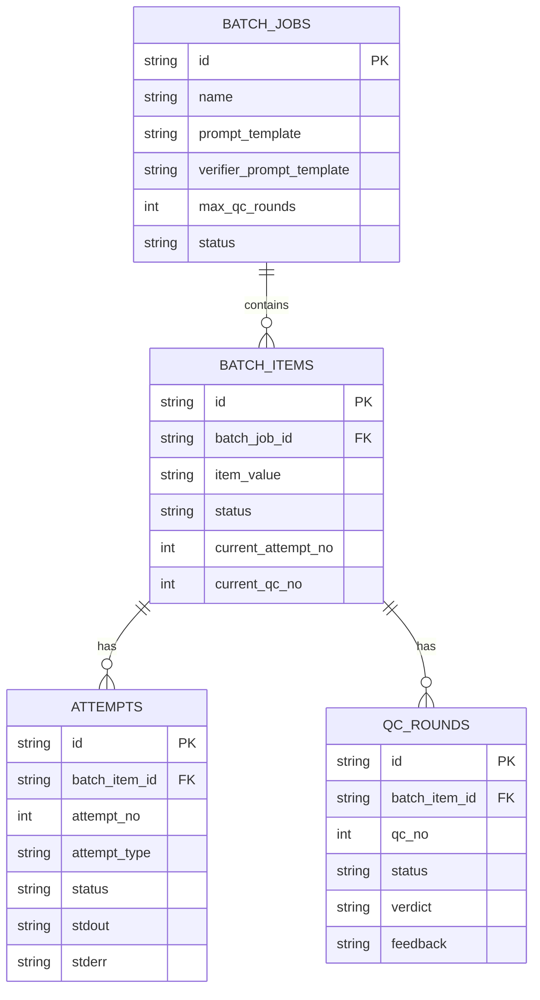
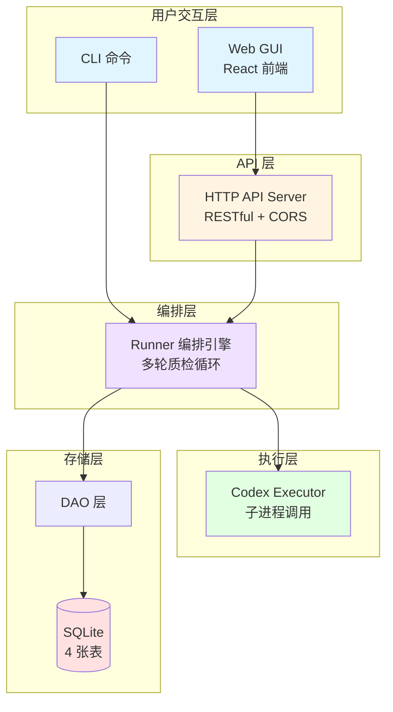
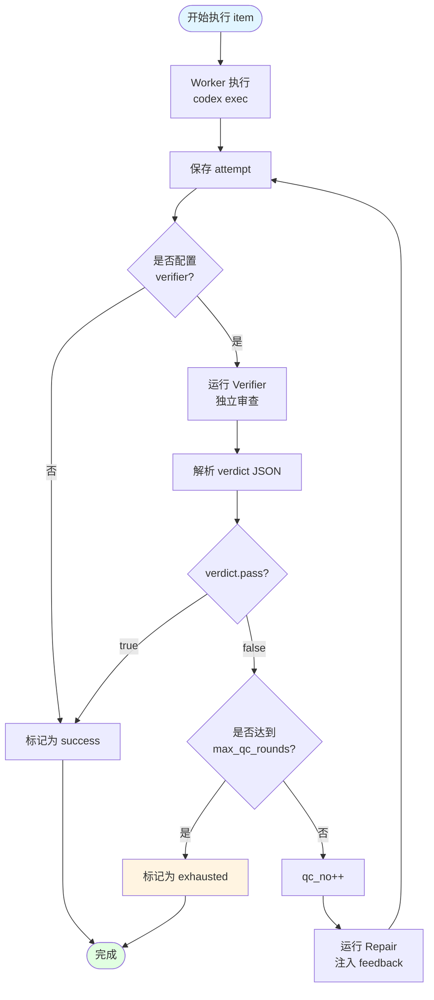
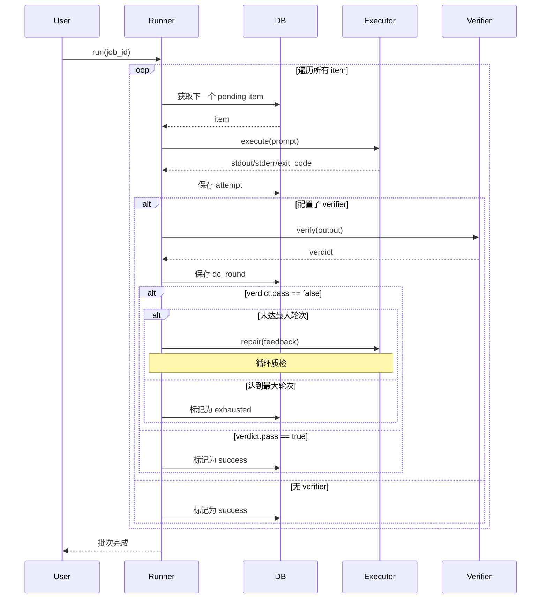

# qcloop 产品需求文档

## 1. 产品概述

### 1.1 产品定位
qcloop 是一个**程序驱动的批量测试编排工具**，用程序遍历替代"让 AI 自觉一个一个做"。通过数据库事务、串行调度、多轮质检确保批量任务不漏项、可追踪。

### 1.2 核心价值
- **不漏项** - 数据库 claim 机制，确保每个测试项都被执行
- **可追踪** - 完整的执行历史、轮次记录
- **多轮质检** - worker -> verifier -> repair 自动闭环
- **可视化** - React 前端实时展示批次状态

### 1.3 目标用户
- Lime 项目开发者
- QA 测试工程师
- 需要批量执行 AI 驱动测试的团队

### 1.4 设计哲学:为什么选择 "程序兜底" 而不是 "AI 自主"

qcloop 最核心的设计选择是 **把停止条件交给程序,而不是交给 AI**。这个选择来自一个判断:当前 AI 自主 loop 方案(例如 Codex `/goal`、Ralph loop)在批量任务上有一个共同的、尚未解决的缺陷——**收敛判定不可靠**。

#### 对比:Codex `/goal` vs qcloop

Codex CLI 0.128.0 在 2026-04-30 引入了 `/goal` slash command,本质是官方版的 Ralph loop:设置一个 objective 后,Codex 会自己在 `plan → act → test → review` 之间循环,直到它**自己判断**目标达成。

| 维度 | Codex `/goal` | qcloop |
|------|--------------|--------|
| **停止条件** | AI 自评 "已完成" / token 预算 | `max_qc_rounds` 确定性上限 |
| **判定主体** | 同一个 thread 内的 AI 自审 | 独立 verifier prompt(外部审查) |
| **收敛保证** | 概率性(可能无限循环) | 确定性(到 N 轮必停) |
| **轮次透明度** | 黑盒 loop,只看最终结果 | 每轮 attempt/qc_round 落库可查 |
| **可复现性** | 取决于 session 状态 | 完整历史可回放 |
| **API 稳定性** | experimental(0.128.0 新增,官方文档未收录) | 可落地的 CLI/HTTP 接口 |
| **最适场景** | 单目标探索("把 p95 降到 120ms 以下") | 批量同质任务(100 个文件 review) |

#### 三个关键差异

**1. token budget 是"软"停止,max_qc_rounds 是"硬"停止**

Codex goal 的 `tokenBudget` 本质是兜底熔断——budget 设得足够大时,行为等同无上限。而 qcloop 的 `max_qc_rounds` 是确定性终态:第 N 轮 verifier 仍 fail,item 直接标记 `exhausted`,**不由 AI 决定**。

**2. AI 自评 vs 外部 verifier**

Goal 的"done 判断"和"工作执行"发生在同一个 thread,AI 很容易"自我合理化"——说服自己"这已经够好了"。qcloop 的 worker 和 verifier 是**独立 prompt、独立判断**,结构上就无法自欺。对于有明确 pass/fail 标准的场景(代码规范检查、格式校验、功能验收),外部 verifier 的严格度碾压自评。

**3. 批量场景下,程序编排 > AI 自由发挥**

Goal 适合"一个复杂目标"(例如重构一个模块)。qcloop 适合"一百个同质任务"(例如 review 一百个文件)。同质任务中,**每一项的行为应该是一致的、可预测的、可审计的**——这正好是程序编排擅长、AI 自由发挥不擅长的。

#### 何时该用 Goal,何时该用 qcloop

- **选 Goal**:单目标探索 / 标准模糊,需要 AI 判断"够好了"/ 个人 overnight 实验 / 愿意接受 experimental 风险
- **选 qcloop**:批量同质任务 / 有明确 pass/fail 标准 / 需要可复现可审计 / 生产 / CI 集成

#### 未来演进:Goal 作为 qcloop 的一种 executor

Goal 的官方基建(token 计数、中断恢复、session 持久化)会持续迭代。未来 qcloop 可以支持把 Goal 作为 executor 后端——**qcloop 保留 `max_qc_rounds` 外壳,每一轮内部用 Goal 做单次执行**,兼得两者优势。详见 `docs/GOAL_INTEGRATION.md` 的 "半自主模式"。

## 2. 核心功能

### 2.1 创建批次

**CLI 方式**：
```bash
qcloop create \
  --name "test-lime" \
  --prompt "测试 Lime 功能: {{item}}" \
  --verifier-prompt "检查结果，输出 JSON: {\"pass\": bool, \"feedback\": string}" \
  --items "a,b,c" \
  --max-qc-rounds 3
```

**Web 方式**：
- 填写批次名称
- 输入 Worker Prompt 模板（支持 `{{item}}` 变量）
- 输入 Verifier Prompt 模板（可选）
- 输入测试项列表（逗号分隔）
- 设置最大质检轮次（默认 3）

**输出**：
- 批次 ID
- 批次状态
- 总测试项数

### 2.2 运行批次

**CLI 方式**：
```bash
qcloop run --job-id <id>
```

**Web 方式**：
- 点击"运行批次"按钮
- 实时查看执行进度
- 2 秒轮询更新状态

**执行流程**：
1. 遍历所有测试项（串行执行）
2. 对每个 item：
   - **Worker**: 替换 prompt 模板中的 `{{item}}`，调用 `codex exec`
   - **Verifier**: 如果配置了 verifier，独立审查结果
   - **Repair**: 如果质检失败，根据 feedback 自动返修
   - 重复直到通过或达到 max_qc_rounds

### 2.3 查询状态

**CLI 方式**：
```bash
qcloop status --job-id <id>
```

**Web 方式**：
- 批次表格视图（9 列）
- 统计卡片（6 个指标）
- 实时更新（2s 轮询）

**显示内容**：
- 批次整体状态（pending/running/completed/failed）
- 测试项统计（总数/成功/失败/进行中/待处理/已耗尽）
- 每个 item 的详细状态

### 2.4 HTTP API

**启动服务器**：
```bash
qcloop serve --addr :8080
```

**API 端点**：
- `POST /api/jobs` - 创建批次
- `GET /api/jobs/:id` - 获取批次
- `POST /api/jobs/run` - 运行批次
- `GET /api/items?job_id=` - 获取批次项（含 attempts 和 qc_rounds）

## 3. 数据模型

### 3.1 数据库表

#### batch_jobs 表
```sql
CREATE TABLE batch_jobs (
    id TEXT PRIMARY KEY,
    name TEXT NOT NULL,
    prompt_template TEXT NOT NULL,
    verifier_prompt_template TEXT,
    max_qc_rounds INTEGER NOT NULL DEFAULT 3,
    status TEXT NOT NULL,  -- pending/running/completed/failed
    created_at TEXT NOT NULL,
    finished_at TEXT
);
```

#### batch_items 表
```sql
CREATE TABLE batch_items (
    id TEXT PRIMARY KEY,
    batch_job_id TEXT NOT NULL,
    item_value TEXT NOT NULL,
    status TEXT NOT NULL,  -- pending/running/success/failed/exhausted
    current_attempt_no INTEGER NOT NULL DEFAULT 0,
    current_qc_no INTEGER NOT NULL DEFAULT 0,
    created_at TEXT NOT NULL,
    finished_at TEXT,
    FOREIGN KEY (batch_job_id) REFERENCES batch_jobs(id)
);
```

#### attempts 表
```sql
CREATE TABLE attempts (
    id TEXT PRIMARY KEY,
    batch_item_id TEXT NOT NULL,
    attempt_no INTEGER NOT NULL,
    attempt_type TEXT NOT NULL,  -- worker/repair
    status TEXT NOT NULL,  -- running/success/failed
    stdout TEXT,
    stderr TEXT,
    exit_code INTEGER,
    started_at TEXT NOT NULL,
    finished_at TEXT,
    FOREIGN KEY (batch_item_id) REFERENCES batch_items(id),
    UNIQUE(batch_item_id, attempt_no)
);
```

#### qc_rounds 表
```sql
CREATE TABLE qc_rounds (
    id TEXT PRIMARY KEY,
    batch_item_id TEXT NOT NULL,
    qc_no INTEGER NOT NULL,
    status TEXT NOT NULL,  -- running/pass/fail
    verdict TEXT,
    feedback TEXT,
    started_at TEXT NOT NULL,
    finished_at TEXT,
    FOREIGN KEY (batch_item_id) REFERENCES batch_items(id),
    UNIQUE(batch_item_id, qc_no)
);
```

### 3.2 数据模型关系图



## 4. 技术架构

### 4.1 系统架构图



### 4.2 核心流程

#### 4.2.1 多轮质检流程图



#### 4.2.2 执行批次时序图



### 4.3 技术栈

**后端**：
- Go 1.21+
- SQLite 3
- cobra（CLI 框架）
- net/http（HTTP 服务器）

**前端**：
- React 18
- TypeScript
- Vite
- 自定义 Hooks（usePollingItems）

**执行器**：
- codex exec（子进程调用）

## 5. 用户故事

### 5.1 作为测试工程师，我想批量执行测试用例

**场景**：我有 100 个 Lime 功能需要测试，手动一个一个测试太慢了。

**需求**：
- 我可以创建一个批次，包含所有测试项
- 系统自动遍历执行每个测试项
- 我可以实时查看执行进度
- 执行完成后可以查看详细结果

**验收标准**：
- ✅ 可以通过 CLI 或 Web 创建批次
- ✅ 批次包含多个测试项（逗号分隔）
- ✅ 系统串行执行所有测试项
- ✅ 可以查看每个测试项的状态
- ✅ 可以查看整体统计（成功/失败/进行中）

### 5.2 作为 QA 负责人，我想确保测试质量

**场景**：AI 执行的测试可能不准确，我需要质检机制来验证结果。

**需求**：
- 我可以配置 verifier prompt 来审查测试结果
- 如果质检失败，系统自动返修
- 支持多轮质检，直到通过或达到上限
- 我可以看到每一轮的质检结果

**验收标准**：
- ✅ 可以配置 verifier_prompt_template
- ✅ verifier 输出 JSON 格式：{"pass": bool, "feedback": string}
- ✅ 质检失败时自动触发 repair
- ✅ 支持设置 max_qc_rounds（最大轮次）
- ✅ 可以查看每一轮的 verdict 和 feedback

### 5.3 作为项目经理，我想追踪批次执行情况

**场景**：我需要了解批次的整体进度和每个测试项的详细状态。

**需求**：
- 我可以看到所有批次的列表
- 每个批次显示关键信息（名称、状态、测试项数、创建时间）
- 我可以点击批次查看详细信息
- 详细页面显示每个测试项的执行情况

**验收标准**：
- ✅ 批次列表显示：名称、ID、状态、测试项数、质检轮次、创建时间、完成时间
- ✅ 状态标签清晰（待处理/运行中/已完成/失败）
- ✅ 可以点击"查看详情"进入批次详情页
- ✅ 详情页显示统计卡片（总数/成功/失败/进行中/待处理/已耗尽）
- ✅ 详情页显示测试项表格（9 列）

### 5.4 作为开发者，我想了解每个测试项的执行细节

**场景**：某个测试项失败了，我需要查看详细的执行日志和质检反馈。

**需求**：
- 我可以看到每个测试项的所有执行尝试（attempts）
- 我可以看到每一轮的质检结果（qc_rounds）
- 我可以看到 stdout、stderr、exit_code
- 我可以看到 verifier 的 verdict 和 feedback

**验收标准**：
- ✅ 测试项表格显示执行摘要（首次 + 质检1/2/3...）
- ✅ 可以展开查看 attempts 列表
- ✅ 可以展开查看 qc_rounds 列表
- ✅ 每个 attempt 显示：attempt_no, attempt_type, status, stdout, stderr, exit_code
- ✅ 每个 qc_round 显示：qc_no, status, verdict, feedback

### 5.5 作为系统管理员，我想控制资源消耗

**场景**：批量测试可能消耗大量 token 和时间，我需要设置预算限制。

**需求**：
- 我可以设置每个批次的 token 预算
- 我可以设置最大质检轮次
- 系统达到限制后自动停止
- 我可以看到实际消耗的 token 和时间

**验收标准**：
- ✅ 可以设置 max_qc_rounds（最大质检轮次）
- ⏳ 可以设置 token_budget_per_item（每个 item 的 token 预算）
- ⏳ 系统追踪 tokens_used 和 time_used
- ⏳ 达到预算后标记为 exhausted

## 6. 用户界面设计

### 6.1 批次列表页面

**页面结构**：
```
┌─────────────────────────────────────────────────────────────┐
│ qcloop - 批量测试编排工具              [+ 新建批次]        │
│ 程序驱动的 AI 批量测试执行器                                │
├─────────────────────────────────────────────────────────────┤
│                                                               │
│  批次列表                                                     │
│  ┌───────────────────────────────────────────────────────┐  │
│  │ 批次名称 │ 批次ID │ 状态 │ 测试项 │ 质检轮次 │ 创建时间 │ 完成时间 │ 操作 │
│  ├───────────────────────────────────────────────────────┤  │
│  │ test-1   │ abc123 │ 🟢完成│ 10项  │ 最多3轮 │ 05-09 23:00 │ 05-09 23:05 │ 查看详情 │
│  │ test-2   │ def456 │ 🔵运行│ 5项   │ 最多2轮 │ 05-09 23:10 │ -           │ 查看详情 │
│  │ test-3   │ ghi789 │ 🟡待处│ 8项   │ 最多3轮 │ 05-09 23:15 │ -           │ 查看详情 │
│  └───────────────────────────────────────────────────────┘  │
│                                                               │
└─────────────────────────────────────────────────────────────┘
```

**关键信息**：
- 批次名称：用户自定义的批次名称
- 批次 ID：显示前 8 位，方便识别
- 状态：待处理/运行中/已完成/失败（带颜色标签）
- 测试项：显示测试项数量
- 质检轮次：显示 max_qc_rounds
- 创建时间：格式化显示（YYYY-MM-DD HH:mm）
- 完成时间：格式化显示，未完成显示 "-"
- 操作：查看详情按钮

### 6.2 批次详情页面

**页面结构**：
```
┌─────────────────────────────────────────────────────────────┐
│ qcloop - 批量测试编排工具                                    │
├─────────────────────────────────────────────────────────────┤
│                                                               │
│  test-lime-workspace                    [▶ 运行批次] [返回列表] │
│  批次 ID: abc-123-def                                        │
│                                                               │
│  ┌─────┐ ┌─────┐ ┌─────┐ ┌─────┐ ┌─────┐ ┌─────┐          │
│  │总数 │ │成功 │ │失败 │ │进行中│ │待处理│ │已耗尽│          │
│  │ 10  │ │  7  │ │  1  │ │  1  │ │  1  │ │  0  │          │
│  └─────┘ └─────┘ └─────┘ └─────┘ └─────┘ └─────┘          │
│                                                               │
│  测试项列表                                                   │
│  ┌───────────────────────────────────────────────────────┐  │
│  │序号│状态│阶段│队列│首次│质检│执行摘要│变更│参数│        │
│  ├───────────────────────────────────────────────────────┤  │
│  │ 1  │🟢成功│已通过│已结束│ 1 │已质检2轮，通过│首次 质检1 质检2│ 1 │item1│
│  │ 2  │🔴失败│已失败│已结束│ 1 │已质检3轮，未通过│首次 质检1 质检2 质检3│ 2 │item2│
│  │ 3  │🔵运行│质检中│运行中│ 1 │已质检1轮│首次 质检1│ 0 │item3│
│  └───────────────────────────────────────────────────────┘  │
│                                                               │
└─────────────────────────────────────────────────────────────┘
```

**关键信息**：
- 批次头部：显示批次名称、ID、操作按钮
- 统计卡片：6 个指标（总数/成功/失败/进行中/待处理/已耗尽）
- 测试项表格：9 列详细信息

### 6.3 批次表格视图

| 列名 | 宽度 | 说明 | 示例 |
|------|------|------|------|
| 序号 | 60px | 批次项编号 | 1, 2, 3... |
| 状态 | 80px | 最终状态标签 | 🟢 成功 / 🔴 失败 / 🟡 进行中 |
| 阶段 | 100px | 当前执行阶段 | 已通过 / 质检中 / 返修中 |
| 队列 | 100px | 队列状态 | 已结束 / 运行中 / 等待中 |
| 首次 | 120px | 首次执行标签 | 1 |
| 质检 | 动态 | 质检摘要 | 已质检 2 轮，通过 |
| 执行摘要 | 300px | 执行标签展示 | 首次 + 质检1 + 质检2 |
| 变更 | 80px | 返修次数 | 2 |
| 参数 | 200px | 测试项参数 | item_value |

### 5.2 状态标签设计

**成功状态**：
```
🟢 成功
背景色: #e1ffe1
文字色: #2d7a2d
```

**失败状态**：
```
🔴 失败
背景色: #ffe1e1
文字色: #d32f2f
```

**进行中状态**：
```
🟡 进行中
背景色: #fff4e1
文字色: #f57c00
```

**已耗尽状态**：
```
⚠️ 已耗尽
背景色: #fff4e1
文字色: #f57c00
```

### 5.3 执行摘要标签

**首次执行**：
```
首次
背景色: #fff
边框: 1px solid #d0e1f9
文字色: #0277bd
```

**质检轮次**：
```
质检1 / 质检2 / 质检3
背景色: #fff
边框: 1px solid #d0e1f9（进行中）
边框: 1px solid #c8e6c9（通过）
边框: 1px solid #ffcdd2（失败）
```

### 5.4 统计卡片

显示 6 个指标：
- 总数
- ✅ 成功
- ❌ 失败
- 🟡 进行中
- ⏳ 待处理
- ⚠️ 已耗尽

### 5.5 实时更新

- 轮询间隔：2 秒
- 自动刷新批次项状态
- 自动更新统计卡片

## 6. 目录结构

```
qcloop/
├── cmd/qcloop/         # CLI 入口
│   └── main.go
├── internal/
│   ├── db/             # 数据库层
│   │   ├── db.go       # 数据库连接
│   │   ├── models.go   # 数据模型
│   │   ├── schema.go   # 表结构
│   │   └── dao.go      # CRUD 操作
│   ├── core/           # 编排引擎
│   │   └── runner.go   # 多轮质检逻辑
│   ├── executor/       # 执行器
│   │   └── codex.go    # codex exec 调用
│   └── api/            # HTTP API
│       └── server.go   # RESTful 服务器
├── web/                # React 前端
│   ├── src/
│   │   ├── components/ # UI 组件
│   │   │   ├── BatchTable.tsx
│   │   │   ├── CreateJobForm.tsx
│   │   │   └── StatusBadges.tsx
│   │   ├── hooks/      # React Hooks
│   │   │   └── usePollingItems.ts
│   │   ├── api/        # API 客户端
│   │   │   └── index.ts
│   │   ├── types/      # TypeScript 类型
│   │   │   └── index.ts
│   │   ├── App.tsx
│   │   ├── main.tsx
│   │   └── styles.css
│   ├── index.html
│   ├── package.json
│   ├── tsconfig.json
│   └── vite.config.ts
├── docs/               # 文档
│   ├── PRD.md          # 完整 PRD
│   └── PRD_SIMPLE.md   # 本文档
├── go.mod
├── go.sum
├── README.md
└── LICENSE
```

## 7. 实施计划

### Stage 1: 数据库层（已完成）
- ✅ SQLite 连接管理
- ✅ 4 张表结构
- ✅ DAO CRUD 操作

### Stage 2: 编排引擎（已完成）
- ✅ Runner 实现
- ✅ 多轮质检循环
- ✅ worker -> verifier -> repair 流程

### Stage 3: 执行器（已完成）
- ✅ Codex Executor
- ✅ 子进程调用
- ✅ stdout/stderr 捕获

### Stage 4: CLI 命令（已完成）
- ✅ create 命令
- ✅ run 命令
- ✅ status 命令
- ✅ serve 命令

### Stage 5: HTTP API（已完成）
- ✅ RESTful 接口
- ✅ CORS 支持
- ✅ 后台运行批次

### Stage 6: React 前端（已完成）
- ✅ 批次表格组件
- ✅ 创建批次表单
- ✅ 状态标签组件
- ✅ 实时轮询更新
- ✅ 统计卡片

## 8. 使用示例

### 8.1 CLI 完整流程

```bash
# 1. 构建
go build -o qcloop ./cmd/qcloop

# 2. 创建批次
./qcloop create \
  --name "test-lime-workspace" \
  --prompt "测试 Lime workspace 功能: {{item}}" \
  --verifier-prompt "检查结果，输出 JSON: {\"pass\": bool, \"feedback\": string}" \
  --items "create,read,update,delete" \
  --max-qc-rounds 3

# 输出：
# ✅ 批次创建成功
# ━━━━━━━━━━━━━━━━━━━━━━━━━━━━━━━━━━━━━━━━
# 批次 ID: abc-123-def
# 批次名称: test-lime-workspace
# 测试项数: 4
# 最大质检轮次: 3
# ━━━━━━━━━━━━━━━━━━━━━━━━━━━━━━━━━━━━━━━━

# 3. 运行批次
./qcloop run --job-id abc-123-def

# 4. 查询状态
./qcloop status --job-id abc-123-def

# 输出：
# 批次状态: test-lime-workspace
# ━━━━━━━━━━━━━━━━━━━━━━━━━━━━━━━━━━━━━━━━
# 批次 ID: abc-123-def
# 状态: completed
# 创建时间: 2024-05-09 23:00:00
# 完成时间: 2024-05-09 23:05:30
# 总耗时: 5m30s
#
# 测试项统计:
#   总数: 4
#   ✅ 成功: 3 (75.0%)
#   ❌ 失败: 0 (0.0%)
#   ⏳ 待处理: 0 (0.0%)
# ━━━━━━━━━━━━━━━━━━━━━━━━━━━━━━━━━━━━━━━━
```

### 8.2 Web 完整流程

```bash
# 1. 启动后端 API
./qcloop serve --addr :8080

# 2. 启动前端（新终端）
cd web
npm install
npm run dev

# 3. 访问 http://localhost:3000
# 4. 填写创建批次表单
# 5. 点击"运行批次"按钮
# 6. 实时查看执行进度
```

## 9. 成功指标

### 9.1 功能指标
- ✅ 支持多轮质检（最多 10 轮）
- ✅ 支持 CLI 和 Web 双界面
- ✅ 实时状态更新（2s 延迟）
- ✅ 完整的执行历史记录

### 9.2 性能指标
- 单个 item 执行时间：< 5 分钟
- 批次创建响应时间：< 100ms
- API 响应时间：< 200ms
- 前端轮询间隔：2s

### 9.3 可用性指标
- 数据库文件大小：< 100MB（1000 个批次）
- 前端构建大小：< 200KB（gzip）
- 内存占用：< 100MB

## 10. 未来规划

### 10.1 短期（1 个月）
- [ ] WebSocket 实时推送（替代轮询）
- [ ] 批次列表页面
- [ ] 批次详情页面（展开查看 attempts 和 qc_rounds）
- [ ] 导出批次报告（JSON/CSV）

### 10.2 中期（3 个月）
- [ ] 并发执行（支持 concurrency 参数）
- [ ] 崩溃恢复（lease 机制）
- [ ] 批次暂停/恢复
- [ ] 批次取消

### 10.3 长期（6 个月）
- [ ] 分布式执行（多机器）
- [ ] 任务优先级
- [ ] 自定义 executor（支持其他 AI SDK）
- [ ] 批次模板管理

## 11. 附录

### 11.1 术语表

- **批次（Batch Job）**：一组测试项的集合
- **批次项（Batch Item）**：单个测试项
- **Worker**：首次执行测试的执行器
- **Verifier**：质检器，审查 worker 的执行结果
- **Repair**：返修器，根据 verifier 的 feedback 修复问题
- **Attempt**：执行尝试，包括 worker 和 repair
- **QC Round**：质检轮次
- **Verdict**：质检判定结果（JSON 格式）

### 11.2 FAQ

**Q: 为什么要用程序遍历而不是让 AI 自觉？**
A: AI 可能会遗漏、重复或中断，程序遍历确保每个测试项都被执行且可追踪。

**Q: 为什么要多轮质检？**
A: 单次执行可能不完美，通过 verifier 审查和 repair 返修，可以提高测试质量。

**Q: 为什么用 SQLite 而不是 PostgreSQL？**
A: SQLite 轻量、无需额外服务、适合单机部署。未来可扩展支持 PostgreSQL。

**Q: 为什么串行执行而不是并发？**
A: MVP 阶段优先保证正确性，未来会支持并发执行。

**Q: 如何自定义 executor？**
A: 当前只支持 codex exec，未来会提供 executor 接口供扩展。

### 11.3 参考资料

- [完整 PRD 文档](./PRD.md)
- [GitHub 仓库](https://github.com/limecloud/qcloop)
- [Codex CLI 文档](https://docs.codex.ai)
